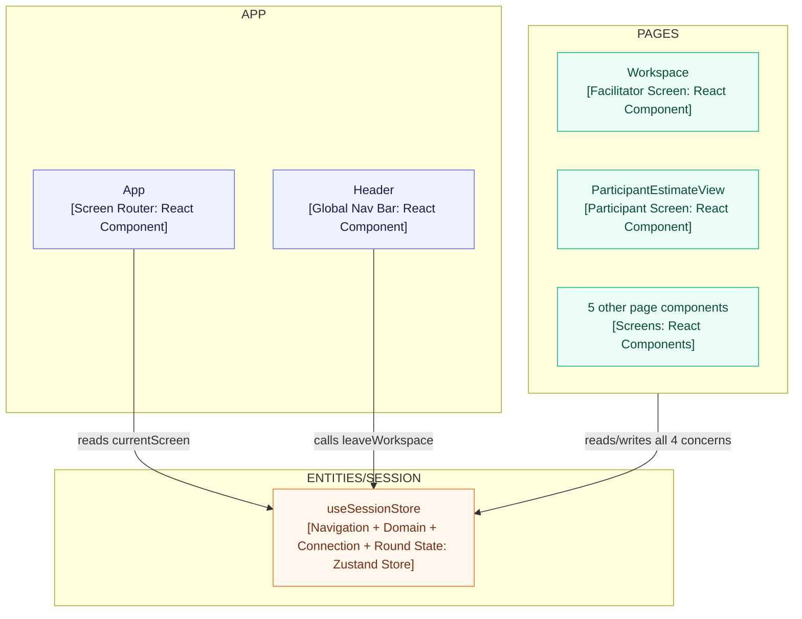
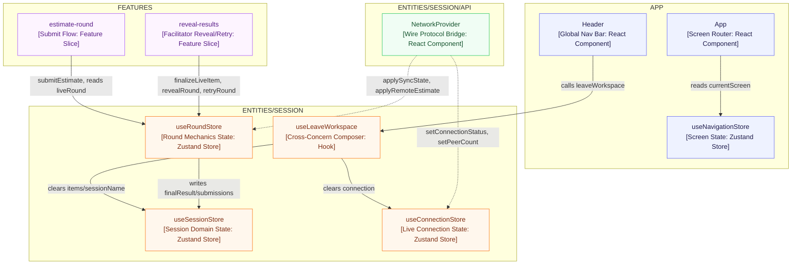
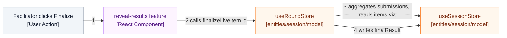

# ADR-005: Decomposing `entities/session`'s Monolithic Store

**Status:** Proposed
**Date:** 2026-09-29
**Related:** [004-feature-sliced-design-architecture.md](004-feature-sliced-design-architecture.md), issue #111

## Context

`entities/session/model/store.ts` (486 lines) moved into its FSD home unchanged
during the ADR-004 migration — decomposing it was deliberately deferred as its
own piece of design work (see ADR-004, "Migration is staged into three
pieces", item 2).

The store mixes four concerns behind one `useSessionStore` hook:

| # | Concern | State | Actions |
|---|---|---|---|
| 1 | App navigation | `currentScreen` | `goToScreen` |
| 2 | Session domain data | `sessionName`, `unit`, `items`, `activeItemId` | `setSessionName`, `setUnit`, `addItem`, `updateItem`, `removeItem`, `reorderItems`, `selectItem`, `setItemNotes`, `setItemDescription` |
| 3 | Live-connection state | `mode`, `role`, `sessionId`, `myName`, `participantId`, `connectionStatus`, `hasEverConnected`, `peerCount`, `participantNames` | `setMode`, `setConnectionStatus`, `setPeerCount`, `applyParticipantName`, `removeParticipant`, `startSingleUser`, `startCollaborative`, `joinLiveSession`, `leaveLiveSession` |
| 4 | Round mechanics | `liveRound` | `finalizeItem`, `finalizeLiveItem`, `revealRound`, `retryRound`, `applySyncState`, `applyRemoteEstimate`, `submitEstimate` |

22 files import `useSessionStore` (7 pages, `App`/`Header`, `NetworkProvider`,
2 `entities/session/lib` hooks, plus tests). A single-user session never
touches concern 3 at all; a manual-entry finalize (`finalizeItem`) never
touches concern 4's round state. These are independent axes bolted together,
not one cohesive domain object.

**Current shape:**

Legend: solid = synchronous call/read.

Two problems this causes concretely:

- **`leaveWorkspace` already crosses concerns internally**: it calls
  `leaveLiveSession()` (concern 3) and then clears `items`/`sessionName`
  (concern 2) in the same method. Nothing marks that boundary today because
  both live in one object.
- **Round mechanics reach into domain data**: `finalizeItem`,
  `finalizeLiveItem`, `revealRound`, `retryRound`, and `applyRemoteEstimate`
  all mutate `items` (concern 2) as part of "running a round" (concern 4).
  Whatever owns round mechanics after the split still needs to mutate items —
  the question is whether that's a same-slice call or a cross-slice one.

## Options considered

### Option A — One store, internal slice pattern

Keep a single `useSessionStore`, but compose it internally from four
slice-creator functions (Zustand's documented "slices" pattern). The runtime
shape doesn't change — one object, one hook — only the source file
organization does.

Rejected: doesn't create a real boundary. A slice's setter can still read and
mutate another slice's fields directly, because they're plain properties of
the same object — the coupling this decomposition is meant to remove would
still compile. It also doesn't map onto FSD's per-slice `model/` convention,
where state ownership should be visible from which layer/slice a file lives
in, not from a comment inside one big file.

### Option B — Split `items` into its own `entities/item` slice

Separate "what is being estimated" (item content) from "the session it's
estimated in" (concern 2 minus `items`).

Rejected for now: nothing else in the app needs an item independent of a
session — there's no second consumer to justify the boundary yet, and
ADR-004 already committed to adding a layer only when something concretely
needs it, not preemptively. Revisit if Roadmap Building (mentioned in
ADR-004's context) turns out to need standalone items.

### Option C — Round mechanics owned by a `features` slice

The initial idea discussed for this decomposition: move concern 4
(`liveRound`, `finalizeItem`, `finalizeLiveItem`, `revealRound`, `retryRound`,
`applySyncState`, `applyRemoteEstimate`, `submitEstimate`) into
`features/estimate-round` and `features/reveal-results`, since both feature
slices already exist and both consume round state.

Rejected on closer inspection: **both `features/estimate-round` and
`features/reveal-results` need this same state**, and FSD forbids same-layer
sibling slices from importing each other. A store living inside one feature
slice can't be a dependency of the other feature slice without violating that
isolation rule — the exact problem ADR-004 hit with `network/actions.ts` and
`RangeBar.tsx`, resolved there by pushing the shared thing down to
`entities/session/api` and `entities/estimate/ui` respectively. The same fix
applies here: round mechanics stays at the `entities` layer, not `features`.

### Option D — Four stores, split along the four concerns, round mechanics stays in `entities/session` (Decision)

- `useNavigationStore` → `app/model/` — concern 1. Navigation isn't owned by
  any entity; it's cross-cutting screen-routing state read by `App`.
- `useSessionStore` → `entities/session/model/session.ts` — concern 2.
- `useConnectionStore` → `entities/session/model/connection.ts` — concern 3.
- `useRoundStore` → `entities/session/model/round.ts` — concern 4, corrected
  from the features placement in Option C.

All three session-entity stores live in the same slice, just different files,
so `useRoundStore`'s methods can call `useSessionStore`'s item setters
directly — that's a same-slice file import, not a cross-slice one, so it
doesn't need a new public-API surface beyond what `entities/session/index.ts`
already exports. `features/estimate-round` and `features/reveal-results` then
both depend downward on `useRoundStore` and `useSessionStore`, same as any
other entity dependency.

**Decomposed shape:**

Legend: solid = synchronous call/read, dotted = async event (network message
arriving via `NetworkProvider`).

**Responsibilities:**

| Node | Responsibility |
|---|---|
| `useNavigationStore` | Which screen is showing; nothing else reads or writes it |
| `useSessionStore` (domain) | Session identity (`sessionName`, `unit`) and the item list's CRUD, notes/description edits |
| `useConnectionStore` | Who is connected, as what role, to what session code; peer roster and names |
| `useRoundStore` | The live round in flight — participant submissions, reveal/retry/finalize outcomes; writes results back into `useSessionStore`'s items |
| `useLeaveWorkspace` | Composes `useConnectionStore.leaveLiveSession()` and `useSessionStore`'s clear-items/name, since after the split neither store alone owns both halves of "leave" |

**Cross-store call flow — finalizing a live item:**

Legend: solid = synchronous call, numbered by call order.

Steps 3 and 4 are a same-slice file import (`round.ts` importing
`session.ts`, both inside `entities/session/model/`), not a cross-slice call —
this is what Option C got wrong by placing round mechanics one layer up.

## Decision

**Adopt Option D**: four stores, one per concern, with round mechanics
staying at the `entities/session` layer (not split into the `features` layer
as originally proposed) so that `estimate-round` and `reveal-results` can
both depend on it without violating same-layer sibling isolation.

The two narrower calls already settled in discussion:

- Separate stores per concern, not one store with internal slices (rejects
  Option A) — a real module boundary should exist, not just a source-file
  convention.
- `items` stays inside `entities/session`, not split into its own entity
  (rejects Option B) — no second consumer exists yet to justify it.

## Consequences

**Positive**
- Each store's shape matches exactly what ADR-004 already established as the
  slice boundaries — no new layer, no speculative structure.
- A single-user session (never touching `useConnectionStore`/`useRoundStore`
  meaningfully) and a manual finalize (never touching `liveRound`) become
  visible as such from which stores a component imports, instead of being
  buried inside one 486-line file.
- `useLeaveWorkspace` becomes the one place that has to know "leaving" spans
  two stores — everywhere else, each store is self-contained.

**Negative / accepted trade-offs**
- Every one of the 22 consumer files needs its `useSessionStore(...)` calls
  re-pointed at the correct one of the four hooks — a mechanical but wide
  change, and the main reason this was deferred out of the ADR-004 migration
  PR.
- `entities/session/model/round.ts` importing `entities/session/model/session.ts`
  is an internal same-slice dependency with no enforcement from Steiger
  (which only checks slice/layer boundaries, not intra-slice file structure)
  — keeping it clean is on code review / the `architecture-review` subagent,
  same as any other in-slice cohesion call.

**Follow-ups / revisit triggers**
- Issue #111 — implement this decomposition once the shape above is
  confirmed.
- Revisit Option B (split `items` into its own entity) if Roadmap Building
  needs items independent of an estimation session.

## Alternatives considered (summary)

| Option | Rejected because |
|---|---|
| A: one store, internal slice pattern | No real module boundary — slices can still read/mutate each other's fields directly |
| B: `items` as its own entity | No second consumer today to justify the split; premature per ADR-004's own "add a layer when needed" principle |
| C: round mechanics owned by a `features` slice | Both `estimate-round` and `reveal-results` need it; FSD forbids same-layer sibling slices depending on each other |
