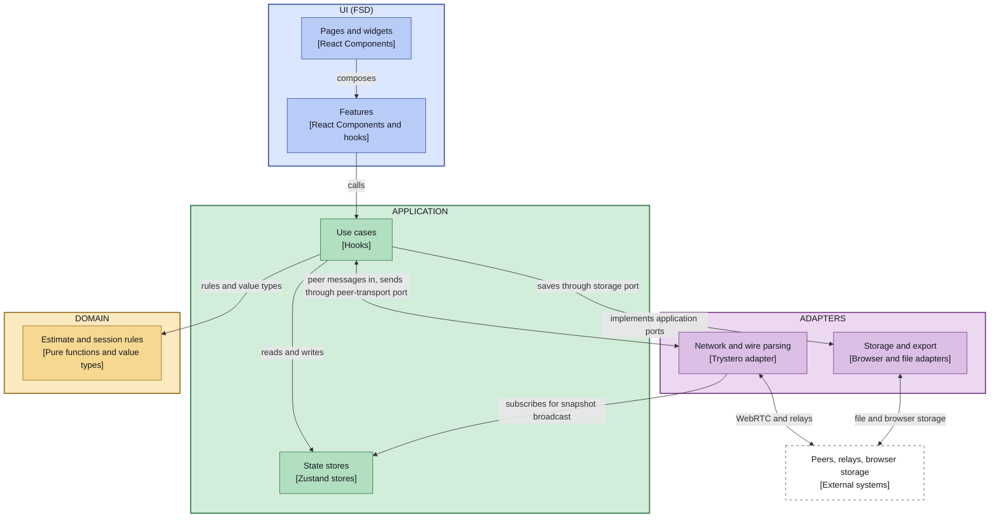

# ADR-009: Architecture Style — FSD Everywhere vs. a Hexagonal Core with an FSD UI

**Status:** Proposed
**Date:** 2026-10-06
**Related:** [004-feature-sliced-design-architecture.md](004-feature-sliced-design-architecture.md), [005-session-store-decomposition.md](005-session-store-decomposition.md), [003-session-reliability-model.md](003-session-reliability-model.md), [001-live-collaboration-architecture.md](001-live-collaboration-architecture.md), [006-router-adoption.md](006-router-adoption.md), [007-e2e-dual-mode-signaling.md](007-e2e-dual-mode-signaling.md)

> This ADR proposes; it moves no code and changes no enforcement. ADR-004 stays in
> force until this one is accepted. If accepted, ADR-004 is superseded **for the
> non-UI part of `src/`** only, and each stage below would be its own change, open to
> revisiting once it lands.

## Context

ADR-004 adopted Feature-Sliced Design (FSD) for the whole of `src/`. A full
architecture review of the repo on 2026-10-05 (three parallel `architecture-review`
passes, plus a follow-up review of the fixes) found about 29 judgment-call issues
that Steiger and oxlint cannot see. The review report itself was not kept in the
repo; the table below records the patterns it found. Most of them cluster around
the same few causes rather than being independent mistakes:

| Cause | Evidence from the review |
|---|---|
| **Domain rules living in the wrong place** because FSD gives them no home of their own | Cone-of-uncertainty math re-implemented in a feature hook; the "who is in the round" rule written twice on two layers; the finalize rule duplicated across two features; `NetworkProvider` (transport) also holding snapshot, resend and prune policies |
| **Entity slices that are really one concept**, forcing cross-slice imports | `entities/participant` and `entities/estimate` were each only used by `entities/session`; the `@x` cross-import surface was added and then removed again once they were folded in |
| **A rule that cannot be enforced with the layer model** | Steiger's `forbidden-imports` rule was switched off for `entities/session/{model,api}` so they could import `estimate` and `participant`; that also silenced its upward-import check for the most central files. The exemption has since been removed, but only because the slices were folded together |
| **Segment semantics that FSD leaves open** | Stateful hooks in `lib/` vs. `model/`; wire parsing in `api/`; storage I/O in `model/` vs. `api/` vs. `lib/` |
| **Use-case logic with no layer** | Estimation/validation inside store actions; teardown and join composition arguably belonging to neither entity nor feature |

All of these were fixed inside FSD (the 2026-10-05/06 refactor and its review follow-ups), at the cost of
folding both extra entity slices into `entities/session` and keeping the pure
estimation core as a convention-only subfolder (`model/estimate/`) that Steiger
cannot enforce.

### What the app is

The PRD describes a product whose weight is not in its UI composition:

| Requirement (PRD) | Implication |
|---|---|
| Two session modes on one domain: live (P2P) and manual (§4.1) | One domain core with two drivers |
| Serverless P2P with graceful degradation (§9, ADR-001, ADR-003) | The transport is infrastructure with real logic, and is already swapped in tests (ADR-007) |
| Persistence, CSV export, shareable link (§2, §9; not built) | More adapters around the same core |
| Bias guards and three-point calculations (§5, §6) | The pure, heavily tested part is the product's value |
| Future phases: story points, T-shirt sizing, backlog import (§12) | Several estimation methods over shared session/item machinery, plus import adapters |

FSD is designed for the UI-composition problem (pages made of widgets made of
features made of entities). This app has a small pure domain, a substantial
protocol/reliability layer and a thin UI. FSD maps well onto the third and badly onto
the first two.

## Options considered

| Option | Idea | Fit | Main cost |
|---|---|---|---|
| **A. Stay with FSD everywhere** (status quo, after the 2026-10-05/06 refactor) | Keep one architecture; fix findings as they appear | No migration; tooling and docs already match | The causes above recur: the domain core has no enforced boundary, and protocol logic has no layer |
| **B. Hexagonal everywhere** | `domain` / `application` / `adapters` / `ui`, dependencies pointing inward only | Best match for the core and the protocol; both modes become two callers of the same use cases; persistence/export become new adapters | Layers are by technical role, so a UI feature's code spreads across several folders; loses FSD's UI composition rules |
| **C. Hybrid: hexagonal core, FSD for the UI** | B for everything non-visual; FSD (`app/pages/widgets/features/shared`) only for the UI | Each part gets the style that fits it; future estimation methods remain vertical UI features over a shared core | Two conventions to learn; a boundary between them to police |
| **D. Explicit state machine for the round** (orthogonal to A–C) | Model collecting / revealed / retry / finalized plus reconnect rules as a transition table or reducer; effects at the edge | The round is already a state machine in ADR-003; transitions become testable without a network | A different way of writing state; scope is the protocol, not the layout |
| **E. Package-by-feature, no strict layers** | Vertical slices plus a small shared kernel | Most flexible | No mechanical enforcement; gives up what Steiger provides today |

## Decision

**Adopt C (hexagonal core, FSD UI), staged so that each stage is independently
valuable and can be stopped after.** Treat D as a separate follow-up decision about
how the round is written, not part of this one.

Target shape (a sketch: the UI lane is simplified). Features and adapters may also use
domain types directly; those edges are left out to keep the diagram readable.

Legend: solid arrow = calls (the arrow points at the callee; a double arrow goes both
ways). When the callee is an adapter, the call goes through an interface that the
application lane owns, so the source-code dependency still points inward. Dashed arrow =
the adapter implements that interface, wired in at composition time. Dashed box =
external system.

| Box | Lane | Responsibility |
|---|---|---|
| **Estimate and session rules** | Domain | Everything pure: `Estimate` and its factory, aggregation, guards, uncertainty guidance, item and round types, roster, snapshot and resend policies, label rules, the finalize rule. No React, no I/O. Keeps the 100% coverage threshold. |
| **Use cases** | Application | Submit, reveal, retry, finalize, join and leave, written as straight-line code: read state, call a domain decision, write state, trigger an effect. Owns the interfaces (ports) that adapters implement, such as the peer transport (today `NetworkSessionApi`). Replaces today's use-case hooks in `features/`. |
| **State stores** | Application | The Zustand stores holding the current session, round and connection state (see "Where state lives"). Replaces the stores in `entities/session/model`. |
| **Network and wire parsing** | Adapters | The Trystero/WebRTC transport, signaling, and validation of untrusted peer messages into domain values. Calls the use cases when a peer message arrives, broadcasts the facilitator's snapshot when the stores change, and implements the peer-transport port the use cases send through. |
| **Storage and export** | Adapters | Participant-identity storage today; future save/load and CSV and link export. Driven by the application through the storage port it implements. An import adapter (backlog import, a later phase) would be a separate driving adapter that calls the use cases, added when that phase is designed. |
| **Features** | UI | UI-only features and their components. They call use cases; they no longer own them. |
| **Pages and widgets** | UI | Screens and widgets composed from features and shared UI, plus routing (ADR-006) and the design system. |
| **Peers, relays, browser storage** | External | Not part of the codebase. |

### Where state lives

State shapes and state transitions are separated from the thing that holds the
current state:

| Lane | Holds | Example |
|---|---|---|
| Domain | The state **shapes** and the **pure transitions** over them, as `(state, event) -> new state` | `Item`, `LiveRound`, reveal and retry of a round, versioned-round rule (ADR-003), applying a snapshot, `finalResultFor` |
| Application | The Zustand **stores** that hold the current state, and the use cases that operate on them | the session, round and connection stores; submit, reveal, finalize |
| UI | Short-lived state belonging to one component | the estimate draft, the selected phase, whether a popover is open |

**This lane is not stateless, unlike textbook hexagonal architecture.** A browser app
has one long-lived, in-process state with one implementation, so a port in front of it
would add ceremony and nothing to swap. Keeping the stores in the application lane
needs no exception to the inward-only dependency rule, because nothing outward is
imported. What it gives up is the textbook claim that the application layer holds no
state.

**Ports exist only at external boundaries.** The peer transport already has one:
`NetworkSessionApi` is an interface that the use cases depend on and React context
injects, and the test relay (ADR-007) is a second implementation behind the signaling
contract. In the hybrid, the interface is owned by the application lane and the
Trystero adapter implements it (the dashed edge in the diagram). The same shape fits
the storage adapter later. Adapters that drive the app, such as incoming peer
messages, call the use cases directly and need no port. The network adapter also reads
state by subscribing to the stores to broadcast the facilitator's snapshot, which is an
inward dependency and needs no port either.

**Use cases are straight-line.** Because they call the stores directly, they are tested
against the real stores (as the hook tests do today), not against fakes. That is only
acceptable if they contain no rules: any `if` that expresses a business rule moves into a
pure domain function with full branch coverage. A review of the 2026-10-05 refactor
found a real bug in exactly such a hook (a stale read of the round at call time), so
this has to be kept true rather than assumed. The `architecture-review` pass should
check it.

Zustand stays out of the domain so that the domain's "no framework, no I/O" rule stays
literal. Today the four stores (`session`, `round`, `connection`, `publicStores`) are the
only files in `entities/session/model` that import a package; the other modules there
import only each other (the connection store also imports the identity helper from
`lib/`; see stage 2), which supports the split. The connection store holds state about
the link, not about the estimate; it is written mostly by the network adapter, with its
pure rules (for example which departed participants to prune) in the domain. The
facilitator remains the authority (ADR-003): their store holds the full round state and
participants hold a derived snapshot; both shapes are domain types.

Moving the transition logic out of the stores' `set(...)` calls is the riskiest part of
stage 3, and most store tests would be rewritten against the pure functions. It also
makes option D (an explicit state machine) a small step later, since the transitions are
already pure functions of state and event.

### Staging

1. **Extract the domain.** Move `entities/session/model/estimate/` and the other pure
   modules (`item`, `types`, `participantId`, `participantLabel`, `roster`, `snapshot`,
   `resend`, `finalResult`) into a `domain/` folder with an enforced "imports nothing
   outside `domain/`" rule. This alone removes the weakest point left after the
   2026-10-05/06 refactor (a convention-only boundary).
2. **Extract the adapters.** Move `entities/session/api/` (transport, wire parsing,
   signaling) and the participant-identity helper into `adapters/`.
   `NetworkProvider` becomes the composition point that wires an adapter to the use
   cases. One catch: `model/connection.ts` currently imports the identity helper,
   so the use case would depend on an adapter, which contradicts the diagram. The
   identity would have to be passed in (a port) or created at the composition point.
3. **Extract the application layer.** Move the stores and use-case hooks into
   `application/`. The FSD `features` layer keeps only UI.

Each stage ends with all CI checks green and can be the last one.

### Enforcement

Both enforcement questions were checked in a throwaway copy of the repo before this
ADR was proposed, using the installed Steiger 0.7.0 with `@feature-sliced/steiger-plugin` 0.8.0 and oxlint 1.78.0.

**FSD for the UI only (Steiger).** Running `steiger ./<ui-folder>` on a folder that
contains only `app`, `pages`, `widgets`, `features` and `shared` works as needed:
it reports `fsd/forbidden-imports` for both an upward import and a sibling-slice
import, the `entities` layer is optional (a tree without it passes), and files outside
the given root are not checked at all. So Steiger can keep guarding the UI after the
split, and it will not see imports that leave the UI folder (see below).

**Domain and application boundaries (oxlint `no-restricted-imports`).** A per-folder
override in `.oxlintrc.json` can express the rules, with these properties:

- It flagged imports of outer lanes (`../ui/**`, `../adapters/**`, `../application/**`
  from `domain/`; `ui` and `adapters` from `application/`), imports of any package
  from `domain/` (including ones never listed, such as a newly added library), and
  left in-domain relative imports alone, including nested ones.
- The package allow-list and the outer-lane ban must be in **one** `patterns` group,
  with the negations (`!./**`, `!../**`) before the outer-lane patterns. Two separate
  groups interfere: the wider negation cancelled the outer-lane ban. This is
  gitignore-style last-match-wins ordering.
- The patterns are path-based, so they depend on the repo using relative imports (it
  does; there are no path aliases). Introducing an alias would require adding it to
  the patterns.
- It cannot tell a use case from an adapter by what it imports, only by folder, so the
  folder layout is what carries the rule.

Imports from the UI into `application/` or `domain/` leave Steiger's root and are
therefore not checked by it; they are allowed by design, and the reverse direction
is covered by the oxlint rule above. A dedicated dependency-boundary tool is not
needed for these rules.

## Consequences

**Positive**

- The domain core gets a boundary that tooling can enforce instead of a convention.
- The estimate-vs-session and entity-vs-feature questions that cost time in the
  review disappear for the non-UI code.
- Protocol and reliability logic (ADR-003) gets a home; it stops accumulating in the
  transport adapter or in feature hooks.
- Save/load, export and import fit as additional adapters without touching the core.
- The UI keeps what FSD does well, and future estimation methods stay vertical UI
  features over one shared core.

**Negative**

- A real migration, in three stages, touching most files; ADR-004, ADR-005, the
  `fsd-architecture` skill, `AGENTS.md`, the review agents and the Steiger config all
  need updating.
- Two conventions in one repo, with a boundary to maintain.
- Features today bundle a use case and its UI; separating them means a UI feature
  and its use case live in different folders.
- Losing Steiger's coverage of the non-UI code in exchange for a different enforcement
  mechanism.

## Questions settled here and questions deferred

| Question | Status |
|---|---|
| Where do the stores live? | Settled: application lane; shapes and transitions in the domain (see "Where state lives") |
| Can Steiger be scoped to the UI folder, and is an `entities` layer required there? | Settled by a check: yes, and no (see "Enforcement") |
| Can the domain and adapter boundaries be enforced with current tooling? | Settled by a check: yes, with oxlint (see "Enforcement") |
| Should the round be an explicit state machine, and with what? | Deferred to a separate decision; the pure transitions from stage 3 are its prerequisite |
| How does the connection store get the participant identity without depending on an adapter? | Deferred to stage 2 (inject it, or create it at the composition point) |
| Folder names and the domain's internal structure per concept | Deferred to stage 1 |
