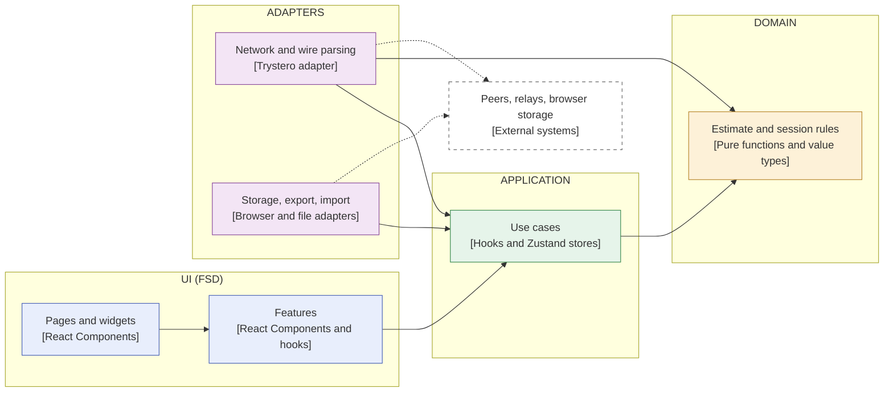

# ADR-009: Architecture Style — FSD Everywhere vs. a Hexagonal Core with an FSD UI

**Status:** Proposed
**Date:** 2026-10-06
**Related:** [004-feature-sliced-design-architecture.md](004-feature-sliced-design-architecture.md), [005-session-store-decomposition.md](005-session-store-decomposition.md), [003-session-reliability-model.md](003-session-reliability-model.md), [001-live-collaboration-architecture.md](001-live-collaboration-architecture.md), [007-e2e-dual-mode-signaling.md](007-e2e-dual-mode-signaling.md)

> This ADR proposes; it does not move any code. ADR-004 stays in force until this one
> is accepted. If accepted, ADR-004 is superseded **for the non-UI part of `src/`** only.

## Context

ADR-004 adopted Feature-Sliced Design (FSD) for the whole of `src/`. A full
architecture review of the repo on 2026-10-05 (three parallel `architecture-review`
passes, plus a follow-up review of the fixes) found 1 High, 10 Medium and 18 Low
judgment-call issues that Steiger and oxlint cannot see. Most of them cluster around
the same few causes rather than being independent mistakes:

| Cause | Evidence from the review |
|---|---|
| **Domain rules living in the wrong place** because FSD gives them no home of their own | Cone-of-uncertainty math re-implemented in a feature hook; the "who is in the round" rule written twice on two layers; the finalize rule duplicated across two features; `NetworkProvider` (transport) also holding snapshot, resend and prune policies |
| **Entity slices that are really one concept**, forcing cross-slice imports | `entities/participant` and `entities/estimate` were each only used by `entities/session`; the `@x` cross-import surface was added and then removed again once they were folded in |
| **A rule that cannot be enforced with the layer model** | The Steiger `forbidden-imports` exemption needed for `session → estimate/participant` also silently switched off the upward-import check for the most central files |
| **Segment semantics that FSD leaves open** | Stateful hooks in `lib/` vs. `model/`; wire parsing in `api/`; storage I/O in `model/` vs. `api/` vs. `lib/` |
| **Use-case logic with no layer** | Estimation/validation inside store actions; teardown and join composition arguably belonging to neither entity nor feature |

All of these were fixed inside FSD (the 2026-10-05/06 refactor and its review follow-ups), at the cost of
folding both extra entity slices into `entities/session` and keeping the pure
estimation core as a convention-only subfolder (`model/estimate/`) that Steiger
cannot enforce.

### What the app is

The PRD describes a product whose weight is not in its UI composition:

| Requirement (PRD) | Implication |
|---|---|
| Two session modes on one domain: live (P2P) and manual (§4.1) | One domain core with two drivers |
| Serverless P2P with graceful degradation (§9, ADR-001, ADR-003) | The transport is infrastructure with real logic, and is already swapped in tests (ADR-007) |
| Persistence, CSV export, shareable link (§2, §9; not built) | More adapters around the same core |
| Bias guards and three-point calculations (§5, §6) | The pure, heavily tested part is the product's value |
| Future phases: story points, T-shirt sizing, backlog import (§12) | Several estimation methods over shared session/item machinery, plus import adapters |

FSD is designed for the UI-composition problem (pages made of widgets made of
features made of entities). This app has a small pure domain, a substantial
protocol/reliability layer and a thin UI. FSD maps well onto the third and badly onto
the first two.

## Options considered

| Option | Idea | Fit | Main cost |
|---|---|---|---|
| **A. Stay with FSD everywhere** (status quo, after the 2026-10-05/06 refactor) | Keep one architecture; fix findings as they appear | No migration; tooling and docs already match | The causes above recur: the domain core has no enforced boundary, and protocol logic has no layer |
| **B. Hexagonal everywhere** | `domain` / `application` / `adapters` / `ui`, dependencies pointing inward only | Best match for the core and the protocol; both modes become two callers of the same use cases; persistence/export become new adapters | Layers are by technical role, so a UI feature's code spreads across several folders; loses FSD's UI composition rules |
| **C. Hybrid: hexagonal core, FSD for the UI** | B for everything non-visual; FSD (`app/pages/widgets/features/shared`) only for the UI | Each part gets the style that fits it; future estimation methods remain vertical UI features over a shared core | Two conventions to learn; a boundary between them to police |
| **D. Explicit state machine for the round** (orthogonal to A–C) | Model collecting / revealed / retry / finalized plus reconnect rules as a transition table or reducer; effects at the edge | The round is already a state machine in ADR-003; transitions become testable without a network | A different way of writing state; scope is the protocol, not the layout |
| **E. Package-by-feature, no strict layers** | Vertical slices plus a small shared kernel | Most flexible | No mechanical enforcement; gives up what Steiger provides today |

## Proposed decision

**Adopt C (hexagonal core, FSD UI), staged so that each stage is independently
valuable and can be stopped after.** Treat D as a separate follow-up decision about
how the round is written, not part of this one.

Target shape (dependencies point from the outer lane to the inner one):

Legend: solid arrow = import dependency; dashed box = external system.

| Lane | Responsibility |
|---|---|
| **Domain** | Everything pure: `Estimate` and its factory, aggregation, guards, uncertainty guidance, roster, snapshot and resend policies, label rules, the finalize rule. No React, no I/O. Keeps the 100% coverage threshold. |
| **Application** | The use cases (submit, reveal, retry, finalize, join, leave) and the stores they write to. Replaces today's use-case hooks in `features/` and the stores in `entities/session/model`. |
| **Adapters** | Anything that talks to the outside: the Trystero/WebRTC transport and wire parsing, signaling, participant-identity storage, and future save/load, CSV and link export, backlog import. |
| **UI (FSD)** | Screens, widgets, UI-only features and the design system. Keeps the FSD layer rules and Steiger for this part only. |

### Staging

1. **Extract the domain.** Move `entities/session/model/estimate/` and the other pure
   modules (roster, snapshot, resend, labels, finalize rule) into a `domain/` folder
   with an enforced "imports nothing outside `domain/`" rule. This alone removes the
   weakest point left after that refactor (a convention-only boundary).
2. **Extract the adapters.** Move `entities/session/api/` (transport, wire parsing,
   signaling) and the identity helper into `adapters/`. `NetworkProvider` becomes the
   composition point that wires an adapter to the use cases.
3. **Extract the application layer.** Move the stores and use-case hooks into
   `application/`. The FSD `features` layer keeps only UI.

Each stage ends with all CI checks green and can be the last one.

### Enforcement

Steiger can keep checking the UI part, but it cannot express "domain imports
nothing" or "adapters depend inward only". Those rules need a different checker
(for example oxlint `no-restricted-imports`, or a dedicated dependency-boundary tool).
Choosing the tool is part of stage 1 and is not decided here.

## Consequences

**Positive**

- The domain core gets a boundary that tooling can enforce instead of a convention.
- The estimate-vs-session and entity-vs-feature questions that cost time in the
  review disappear for the non-UI code.
- Protocol and reliability logic (ADR-003) gets a home; it stops accumulating in the
  transport adapter or in feature hooks.
- Save/load, export and import fit as additional adapters without touching the core.
- The UI keeps what FSD does well, and future estimation methods stay vertical UI
  features over one shared core.

**Negative**

- A real migration, in three stages, touching most files; ADR-004, ADR-005, the
  `fsd-architecture` skill, `AGENTS.md`, the review agents and the Steiger config all
  need updating.
- Two conventions in one repo, with a boundary to maintain.
- Features today bundle a use case and its UI; separating them means a UI feature
  and its use case live in different folders.
- Losing Steiger's coverage of the non-UI code in exchange for a different enforcement
  mechanism.

## Open questions

- Where should stores live: in `application/` with the use cases, or in `domain/`
  as state holders? (Today's stores contain both.)
- Can Steiger be scoped to the UI folder only, and does it still require an
  `entities` layer there for UI-only entity components (for example `RangeBar`)?
- Should the round be written as an explicit state machine (option D), and with a
  library or a hand-rolled reducer? This is a separate decision.
- Folder names and whether `domain` needs internal sub-structure per concept.

## What this ADR does not do

It moves no code and changes no enforcement. Accepting it means agreeing on the
direction and the staging; each stage would be its own PR and may be revisited after
it lands.
