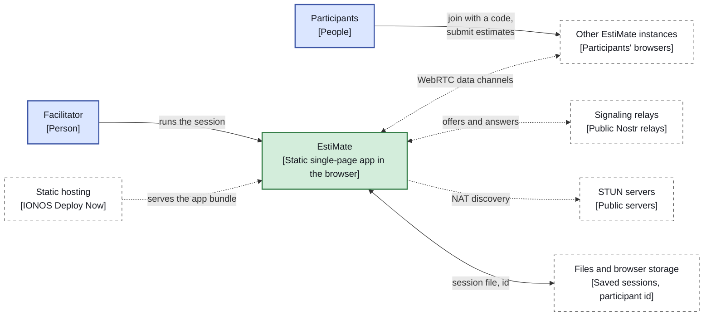
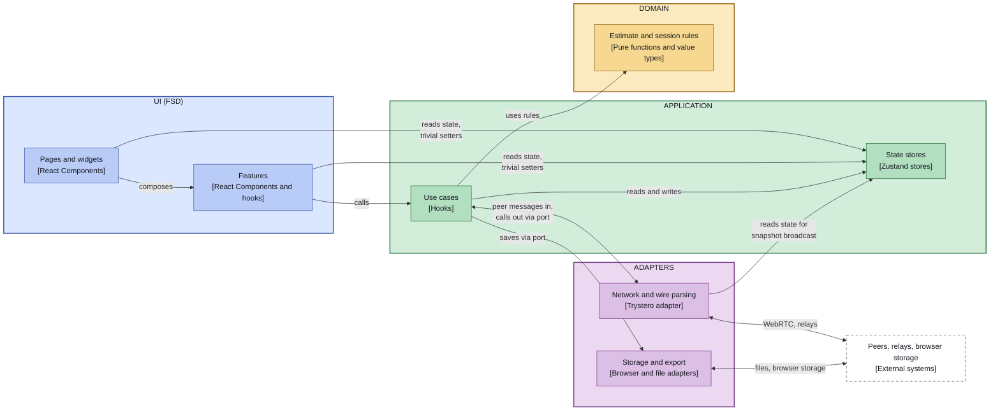

# EstiMate — Technical Architecture

**Status:** Accepted. Structured after [arc42](https://arc42.org); this is the living description of the current architecture.
**Based on:** [prd.md](prd.md), [ADR-001](adr/001-live-collaboration-architecture.md), [ADR-003](adr/003-session-reliability-model.md), [ADR-009](adr/009-architecture-style-fsd-vs-hexagonal-core.md)

Decisions and their history live in the [ADRs](adr/); implementation detail of single
topics lives in [concepts/](concepts/). This document is the map: it states how the system
is built today, holds the context view and the building-block views, and links out for the
rest. The words it uses are defined in the [glossary](glossary.md).

## 1. Introduction and goals

EstiMate is a live three-point estimation tool for dev teams. A team estimates a backlog
item by item, each member gives a best, most likely and worst case, and the app turns the
submissions into a range with a confidence interval and counters known estimation biases
([PRD](prd.md) §2).

| Goal | Meaning for the architecture |
|---|---|
| Estimate live, together, with no server we operate | Peer-to-peer sessions (ADR-001) on a static single-page app |
| A solo facilitator can use it too | Manual mode shares the estimation engine and the screens with Live mode |
| Defensible ranges, bias guards | The estimation engine is pure, framework-free and identical in both modes |
| Save and reopen a session later | Local-first, file-based persistence (section 8) |

Stakeholders: the facilitator, the participants, and the maintainers (Christian and Claude Code).

## 2. Constraints

| Constraint | Source |
|---|---|
| No backend operated by the product for live communication. Signaling uses public relays, NAT traversal uses public STUN servers | ADR-001, PRD §9 |
| Static SPA: React 19, TypeScript (`strict`, `noUncheckedIndexedAccess`), Vite, Zustand, `react-router` | AGENTS.md, ADR-006 |
| Nocturne design system ported verbatim (`src/design/nocturne.css` is never edited, no Tailwind) | Section 9 |
| Last two versions of evergreen Chrome, Firefox, Safari and Edge | AGENTS.md |
| Solo-maintained: every change goes through a branch and a PR with required CI checks, Conventional Commit titles | AGENTS.md, [runbook](runbook.md) |

## 3. Context and scope

Legend: solid arrow = a person uses the system or a file moves, dotted = data flows between the
app and an external system, `<-->` = both directions. Dashed box = external system. Edge labels
say what crosses the edge.

| External party | Interface |
|---|---|
| Other EstiMate instances | Direct WebRTC data channels, typed wire actions (`adapters/network/actions.ts`). Every inbound message is untrusted ([trust boundary](concepts/collaboration-mode.md)) |
| Signaling relays | Trystero's Nostr strategy exchanges offers and answers. The e2e suite uses a local WebSocket relay instead (ADR-007) |
| STUN servers | Public servers for NAT traversal. No TURN server is operated (ADR-001) |
| Static hosting | Serves the built bundle, deployed by CI ([runbook](runbook.md)) |
| Files and browser storage | A stable per-browser participant id today, session files for save and load later |

## 4. Solution strategy

| Strategy | Decision |
|---|---|
| Hexagonal core with an FSD UI | Pure domain, application (use cases and stores), adapters for the outside world, and a Feature-Sliced Design UI. Dependencies point inward ([ADR-009](adr/009-architecture-style-fsd-vs-hexagonal-core.md), [ADR-004](adr/004-feature-sliced-design-architecture.md)) |
| Peer-to-peer live sessions | Trystero over WebRTC, no operated backend (ADR-001) |
| Facilitator owns the live state | Versioned rounds, a values-free submission roster, acknowledged submissions (ADR-003) |
| One estimation engine for both modes | `aggregateEstimates` is called with N submissions or one (section 8) |
| Three small stores | Session, connection and round state are separate Zustand stores (ADR-005) |
| Boundaries enforced by tools | Steiger for the UI, oxlint for the layer imports, type tests for the store views (section 5) |

## 5. Building block view

### Level 1: layers

Features and adapters may also use domain types directly; those edges are left out to keep the
diagram readable. The arrow from the UI to the application layer stands for both of its uses:
calling use cases and reading the stores.

Legend: solid arrow = calls (the arrow points at the callee, a double arrow goes both ways). When
the callee is an adapter, the call goes through an interface the application layer owns, so the
source-code dependency still points inward. Dashed amber arrow = the adapter implements that
interface, wired in at composition time. Dashed box = external system.

### Level 2: what is inside each layer

Legend: same notation as above. The ports and the "implements" relationship appear in the
layer view only.

| Box | Layer | Responsibility |
|---|---|---|
| **Estimate and session rules** | Domain | Everything pure: `Estimate` and its factory, aggregation, guards, uncertainty guidance, item and round types, roster, snapshot and resend policies, label rules, the finalize rule. No React, no I/O. Keeps the 100% coverage threshold. |
| **Use cases** | Application | Submit, reveal, retry, finalize, join and leave, written as straight-line code: read state, call a domain decision, write state, trigger an effect. Owns the interfaces (ports) that adapters implement, such as the peer transport (`ports/outbound/networkTransport.ts`, since stage 3c). Replaces the use-case hooks that were in `features/` (stage 3a: now `src/application/useCases`; `features/` keeps thin navigation wrappers). |
| **State stores** | Application | The Zustand stores holding the current session, round and connection state (see "Where state lives"). Lives in `src/application/stores` (stage 3a). The UI reads them directly with selectors and may call a few trivial field setters (session name, unit, item selection and text fields); every other write goes through a use case (stage 3b-2). |
| **Network and wire parsing** | Adapters | The Trystero/WebRTC transport, signaling, and validation of untrusted peer messages into domain values. Calls the use cases when a peer message arrives, broadcasts the facilitator's snapshot when the stores change, and implements the peer-transport port the use cases send through. |
| **Storage and export** | Adapters | Participant-identity storage today; future save/load and CSV and link export. Called by the application through the storage port it implements (an outbound adapter). An import adapter (backlog import, a later phase) would be a separate inbound adapter that calls the use cases, added when that phase is designed. |
| **Features** | UI | UI-only features and their components. They call use cases; they no longer own them. |
| **Pages and widgets** | UI | Screens and widgets composed from features and shared UI, plus routing (ADR-006) and the design system. |
| **Peers, relays, browser storage** | External | Not part of the codebase. |

### Where state lives

State types and state transitions are separated from the thing that holds the
current state:

| Layer | Holds | Example |
|---|---|---|
| Domain | The state **types** and the **pure transitions** over them, as `(state, event) -> new state` | `Item`, `LiveRound`, reveal and retry of a round, versioned-round rule (ADR-003), applying a snapshot, `finalResultFor` |
| Application | The Zustand **stores** that hold the current state, and the use cases that operate on them | the session, round and connection stores; submit, reveal, finalize |
| UI | Short-lived state belonging to one component | the estimate draft, the selected phase, whether a popover is open |

**This layer is not stateless, unlike textbook hexagonal architecture.** A browser app
has one long-lived, in-process state with one implementation, so a port in front of it
would add ceremony and nothing to swap. Keeping the stores in the application layer
needs no exception to the inward-only dependency rule, because nothing outward is
imported. What it gives up is the textbook claim that the application layer holds no
state.

**Ports exist only at external boundaries.** The peer transport already has one:
`NetworkSessionApi` is an interface that the use cases depend on and React context
injects, and the test relay (ADR-007) is a second implementation behind the signaling
contract. In the hybrid, the interface is owned by the application layer and the
Trystero adapter implements it (the dashed edge in the diagram). The same pattern fits
the storage adapter later. Inbound adapters, such as incoming peer
messages, call the use cases directly and need no port. The network adapter also reads
state by subscribing to the stores to broadcast the facilitator's snapshot, which is an
inward dependency and needs no port either.

**Use cases are straight-line.** Because they call the stores directly, they are tested
against the real stores (as the hook tests do today), not against fakes. That is only
acceptable if they contain no rules: any `if` that expresses a business rule moves into a
pure domain function with full branch coverage. A review of the 2026-10-05 refactor
found a real bug in exactly such a hook (a stale read of the round at call time), so
this has to be kept true rather than assumed. The `architecture-review` pass should
check it.

Zustand stays out of the domain so that the domain's "no framework, no I/O" rule stays
literal. The four stores (`session`, `round`, `connection`, `publicStores`) are the
only files in `src/application/stores` that import a package; the pure modules that
used to sit beside them now live in `src/domain/` (stage 1) and import only each other (stage 2 removed the connection store's one adapter import, the identity helper: the store now receives the id as an argument), which supports the split. The connection store holds state about
the link, not about the estimate; it is written mostly by the network adapter, with its
pure rules (for example which departed participants to prune) in the domain. The
facilitator remains the authority (ADR-003): their store holds the full round state and
participants hold a derived snapshot; both are domain types.

Moving the transition logic out of the stores' `set(...)` calls is the riskiest part of
stage 3, and most store tests would be rewritten against the pure functions. It also
makes option D (an explicit state machine) a small step later, since the transitions are
already pure functions of state and event.

### Staging

1. **Extract the domain (done).** Move `entities/session/model/estimate/` and the other pure
   modules (`item`, `types`, `participantId`, `participantLabel`, `roster`, `snapshot`,
   `resend`, `finalResult`) into a `src/domain/` folder with an enforced "imports nothing
   outside `domain/`" rule. This alone removes the weakest point left after the
   2026-10-05/06 refactor (a convention-only boundary).
2. **Extract the adapters (done).** Move `entities/session/api/` (transport, wire parsing,
   signaling) and the participant-identity helper into `adapters/`.
   `NetworkProvider` becomes the composition point that wires an adapter to the use
   cases. One catch: `model/connection.ts` currently imports the identity helper,
   so the use case would depend on an adapter, which contradicts the diagram. The
   identity would have to be passed in (a port) or created at the composition point.
   As built: the wire files went to `src/adapters/network/` and the identity helper to
   `src/adapters/storage/`. The join use case (`useJoinLiveSession`) reads the id through an
   application-owned identity port (`ParticipantIdentityApi`, provided in `app/App.tsx`) and
   passes it to `joinLiveSession` as an argument, so the store imports no adapter.
   `ConnectionStatus` moved into `src/domain/types.ts` because both the adapter and the
   store need it. `NetworkProvider`, the `NetworkSessionApi` port, `retryPolicy` and
   `sessionCode` stayed in `entities/session/api` until stage 3a moved them to `src/application`.
   In stage 3a `NetworkProvider` still imported the network adapter, so the oxlint rule carried
   one named exception for it; stage 3c removed it.
3. **Extract the application layer (done).** Move the stores and use-case hooks into
   `application/`. The FSD `features` layer keeps only UI. Sub-steps: 3a moves the code
   (done); 3b-1 moves the store rules into the domain (done); 3b-2 narrows the UI-visible store types and adds `useItemActions` (done); 3c splits `NetworkProvider` (done); 3d retires the UI-only `entities/session` slice (done).
   As built in 3a: `src/application/` holds `stores/` (`session`, `round`, `connection`,
   `publicStores`, and `index.ts`, which the use cases import), `ports/`
   (`NetworkSessionApi` and `ParticipantIdentityApi` with their React contexts and hooks),
   `useCases/` (join, teardown, reconnect, start collaborative, start single-user, close
   workspace, reveal actions, submit estimate, finalize estimate, plus `retryPolicy` and
   `sessionCode`, each beside its only consumer) and `NetworkProvider.tsx`, which still held the connect, resend, pull,
   prune and broadcast logic (split in 3c). `src/application/index.ts` is the layer's barrel and the only
   thing the UI imports from it. The use cases contain no navigation: `features/session-lifecycle`
   keeps thin wrappers that add it (`useStartCollaborative`, `useStartSingleUser`,
   `useLeaveWorkspace`, `useLeaveLiveSession`) plus the UI flow `useJoinFlow`, and
   `features/reveal-results`' `useRevealRound` is the labelled roster view plus `useRevealActions`.
   At the end of 3a, `entities/session` held only UI (`ItemDetailShell`, `EstimateTriple`, `RangeBar`,
   `DescriptionField`; split in 3d, below) and its barrel exported only the first three; UI code imports
   domain symbols from `src/domain` directly. Enforcement as built: an oxlint override on
   `src/application/**` lets it import the domain and itself only (no FSD layers, no
   adapters), with a second override naming `NetworkProvider.tsx` and its test as the one
   temporary exception allowed to import `adapters/network/session` and
   `adapters/network/connection` (removed in 3c). The adapters rule and the "only `app/` composes adapters" rule
   are unchanged. A guard test, `src/viMockPaths.test.ts`, fails when a relative `vi.mock`
   target does not resolve, so a moved module cannot leave a mock pointing at a file that no longer exists (it does not detect a mock of a module the code under test stopped importing).

   As built in 3b-1: the rules that sat inside the stores' `set(...)` calls and in
   `NetworkProvider` are pure functions in `src/domain/`, and the stores only hold state
   and call them. `connection.ts` has `deriveConnectionStatus` (moved out of
   `NetworkProvider`), `normalizeSessionCode`, `facilitatorStart`, `participantJoin`,
   `withConnectionStatus` (with the `hasEverConnected` latch) and `leavingNeedsConfirm`.
   `item.ts` gained `firstPendingItemId`, `appendItem`, `removeItemFrom`, `moveItem` and
   `updateItem`. `round.ts` has `upsertByParticipant`, `retryRoundPatch`,
   `acceptRemoteEstimate` (the ADR-003 drop rules), `recordOwnSubmission`, `adoptSnapshot`
   (versioned rounds, reveal-gated submissions, `mySubmission` carry-over); `snapshot.ts`
   gained `sessionFieldsFromSnapshot`. `delivery.ts` holds the `DeliveryState` type and
   `deliveryStateFor` (called by `useSubmitEstimate`; the UI imports the `DeliveryState` type from `src/domain/delivery`), `navigation.ts`
   holds `advanceFrom` and `previousItemId`, and `participantId.ts` gained
   `LOCAL_PARTICIPANT_ID`. Two application additions: `useCases/applyFacilitatorSnapshot.ts`
   (not a hook; writes the session name and unit, then the round view) and
   `useCases/finalizeWith.ts` (the finalize step shared by `finalizeEstimate` and
   `useRevealActions`). The round store no longer reads the connection store, so the
   store import cycle risk noted in ADR-005 is gone.

   As built in 3b-2: the UI-access rule (decided 2026-10-08). The UI may read store state
   with selectors and may call the trivial field setters directly (`setSessionName`,
   `setUnit`, `selectItem`, `setItemTitle`, `setItemNotes`, `setItemDescription`). Every
   write that carries a rule goes through a use case: `useItemActions` (add, remove,
   reorder) joins `useRevealActions`, `useJoinLiveSession`, `useCloseWorkspace` and the
   rest. `stores/publicStores.ts` now gives the UI explicit, read-only, state-only views plus
   those setters for all three stores (selectors, `getState` and `subscribe`, no `setState`),
   so calling any other action, or writing state around the use cases, is a compile error
   (pinned by exact-key type tests). Tests that seed state import the full stores from
   `application/testing`, which the lint rule allows in test files only, and the barrel-only lint rule keeps the UI from importing
   the full stores that use cases and `NetworkProvider` use (`stores/index.ts`). The
   stores are not moved into the UI: the network code and the use cases write them too,
   so a UI-owned store would have forced a storage port. The round store's
   `applySyncState` became `applyRoundSnapshot`, since it adopts only the round part of a
   snapshot (`applyFacilitatorSnapshot` applies the whole thing); the title rule behind `setItemTitle` is now the domain's `renameItem` (a blank title is ignored, as for a new item, so an item cannot lose its name — the one small behaviour change in this stage); the dead `setMode` was
   removed.

   As built in 3c: `application/ports/outbound/networkTransport.ts` defines `TransportSession`,
   `ConnectionState` and `JoinSession` (no React; `ParticipantAnnounce` is a domain type in
   `domain/types.ts`, since `announcementFor` builds it); `adapters/network` implements it
   and imports these types, and the lint rule lets adapters import only the
   `application/ports/outbound/` folder, where React-free ports for external systems live
   (the React contexts stay in `ports/`). `application/useCases/liveSessionController.ts` exports
   `createLiveSessionController({ joinSession })`, returning `{ api, dispose }`; it holds
   what `NetworkProvider` used to (connect, disconnect, `sendEstimate` with retry, resend,
   snapshot pull, roster prune, announce, facilitator broadcast) and is tested without React
   against a fake transport. `src/app/NetworkProvider.tsx` is a ~25-line shell that wires
   `adapters/network`'s `joinSession` into the controller and provides
   `NetworkSessionContext`; the application barrel no longer exports `NetworkProvider` or the controller: those, with
   `NetworkSessionContext` and the port types the shell needs, come from a separate
   `application/composition.ts` entry that the lint rule allows in `src/app` and in test
   files only. The identity port's context and the `useNetworkSession` / `useParticipantIdentity`
   hooks moved there too: no UI code outside `application` used them, only the composition
   root and tests that provide them. The
   temporary oxlint exception is gone: `application` imports no adapter at all. Three small
   predicates moved into the domain: `shouldBroadcastSnapshot` and `announcementFor`
   (`domain/connection.ts`) and `roundKey` (`domain/resend.ts`).

   As built in 3d: `entities/session` held only UI by then, two concepts that never import
   each other, so it became `entities/item` (`ItemDetailShell`, `DescriptionField`) and
   `entities/estimate` (`EstimateTriple`, `RangeBar`), mirroring `domain/item.ts` and
   `domain/estimate`. Each is used by several features or pages, so the cross-slice
   problem described in the Context does not return. The `ConnectionStatus` types did not
   move next to the transport port, as first planned: the domain function
   `deriveConnectionStatus` takes the transport's status, and the domain may import
   nothing outside itself, so the types stay in `domain/types.ts` and the port and the
   adapter import them from there.

Each stage ends with all CI checks green and can be the last one.

### Enforcement

Both enforcement questions were checked in a throwaway copy of the repo before this
ADR was proposed, using the installed Steiger 0.7.0 with `@feature-sliced/steiger-plugin` 0.8.0 and oxlint 1.78.0.

### Where things live

| Part | Location |
|---|---|
| Domain | `src/domain` (rules and types), `src/domain/estimate` (the estimation engine, formerly `/calc`) |
| Application | `src/application`: `stores/` (session, connection, round, plus the narrowed `publicStores`), `useCases/` (including the live-session controller), `ports/` and `ports/outbound/` (the peer transport), `composition.ts` and `testing.ts` (entries for `src/app` and tests only), `index.ts` (the barrel the UI imports) |
| Adapters | `src/adapters/network` (Trystero transport, wire actions and parsing, signaling), `src/adapters/storage` (participant id) |
| Composition | `src/app`: `App.tsx` provides the identity port, `NetworkProvider.tsx` is the thin React shell that wires the network adapter into the live-session controller |
| UI | `src/pages`, `src/widgets`, `src/features`, `src/entities` (`item`, `estimate`), `src/shared`. The slice mapping is in ADR-004 and the placement helper is `.claude/skills/fsd-architecture` |
| Styling | `src/design` holds the verbatim Nocturne port and generic composed patterns, component CSS sits beside its component |

### Rules

These are the architecture rules. Each has an ID so that scanners, the review agent and the
skill can cite it.

| ID | Rule | Enforced by |
|---|---|---|
| R1 | The domain imports nothing outside itself, uses no I/O globals, and only test files import `vitest`. It keeps 100% test coverage | oxlint override on `src/domain/**`, coverage threshold in `vite.config.ts` |
| R2 | The application layer imports the domain and itself. It may use React and Zustand, but no UI layer, router, transport library or adapter | oxlint override on `src/application/**` |
| R3 | Adapters import the domain, other adapters and packages other than React, Zustand and the router. From the application they import only `application/ports/outbound/**` | oxlint override on `src/adapters/**` |
| R4 | Inside the UI, imports point downward (`app`, `pages`, `widgets`, `features`, `entities`, `shared`), and a slice is reached only through its `index.ts` | Steiger (`pnpm arch`) |
| R5 | The UI never imports an adapter. It imports the application only through `src/application/index.ts`. The `composition` and `testing` entries are for `src/app` and test files only | oxlint overrides on the UI folders |
| R6 | Only `src/app` composes the application with an adapter | R5 together with R2 |
| R7 | The UI reads store state through selectors on read-only views and may call only the trivial field setters. Every rule-bearing write goes through a use case | Type tests on the exported views (`publicStores.test.ts`), R5 |
| R8 | Store action or use case: code that reaches another store, calls a port or triggers an effect is a use case. Stores do not reach into each other, except the round store writing items through `patchItem` (ADR-005) | `architecture-review` agent |
| R9 | Ports exist only at real external boundaries (peer transport, identity and storage) and are owned by the application layer | `architecture-review` agent |
| R10 | Pure decisions live in the domain as unit-tested functions, never inline in stores, use cases, adapters or components | `architecture-review` agent, domain coverage |
| R11 | A relative `vi.mock` target must resolve, so a moved module cannot leave a stale mock | `src/viMockPaths.test.ts` |

The oxlint rules are path-based and rely on relative imports (there are no path aliases).

## 6. Runtime view

| Scenario | Where it is described |
|---|---|
| Join a live session, participant and facilitator sides | [collaboration-mode](concepts/collaboration-mode.md): join sequence |
| Estimate round, reveal, retry, finalize | [collaboration-mode](concepts/collaboration-mode.md): estimate round and facilitator reveal |
| Late join and reconnect: the snapshot pull | [collaboration-mode](concepts/collaboration-mode.md): snapshot pull on connect and reconnect |
| Connection states and what a participant is told | [collaboration-mode](concepts/collaboration-mode.md): connection state machine |
| End-to-end flows under test | [e2e-testing](concepts/e2e-testing.md) |
| Single-user estimate and finalize | The same use cases without the live-session controller: `finalizeEstimate` aggregates one estimate with the shared engine |

## 7. Deployment view

The app is a static bundle. CI builds and checks it on every pull request and on `main`, and the
IONOS Deploy Now pipeline publishes `main`. There is no server-side component. The e2e suite runs
against a locally self-hosted signaling relay by default and against the public relays nightly
([ADR-007](adr/007-e2e-dual-mode-signaling.md)). Pipeline, secrets and releases are in the
[runbook](runbook.md).

## 8. Crosscutting concepts

| Concept | Summary | Detail |
|---|---|---|
| Estimation engine | One aggregation function for both modes (min of best, median of likely, max of worst, McConnell's CI90), bias guards that return structured signals, and `Estimate` as a self-validating value type created only through `createEstimate` | [estimation-engine](concepts/estimation-engine.md) |
| Live sync | Room id is the 6-character session code (Crockford base32) under a fixed `appId`. Trystero's Nostr strategy is the default, a self-hosted WebSocket relay is the escape hatch. A room password is optional. The facilitator's items are the single source of truth: participants send estimates only to the facilitator, and everyone else receives `syncState` snapshots. A peer that connects or reconnects pulls the snapshot itself (`requestSnapshot`) | ADR-001, ADR-003, [collaboration-mode](concepts/collaboration-mode.md) |
| Reliability | Versioned rounds, a values-free roster, acknowledged submissions with a kind-driven retry policy, a stable per-browser participant id, role-asymmetric link state | ADR-003 |
| Trust boundary | Every inbound peer message is validated into domain values at the adapter edge, so the UI only sees valid `Estimate`s | [collaboration-mode](concepts/collaboration-mode.md): trust boundary |
| State and UI access | Three stores in the application layer, read-only narrowed views for the UI, use cases for rule-bearing writes (R7, R8) | ADR-005, ADR-009 |
| Navigation | `react-router`. Use cases contain no navigation, `features/session-lifecycle` wraps them with it | ADR-006 |
| Persistence | Local-first and file-based. A session (name, unit, items) is saved as a JSON file and restored from one, live-round fields are excluded. Load is allowed before a live session starts, because importing mid-session would desync participants. A participant never has a local item list. No accounts, no cross-device sync in the MVP. Not built yet | PRD §8, issue #10 |
| Testing | Unit and component tests, a thin Playwright layer for real WebRTC, type tests for the store views, 100% coverage on the domain | ADR-002, ADR-007, [e2e-testing](concepts/e2e-testing.md) |
| Accessibility | oxlint `jsx-a11y`, `jest-axe` scans, `@axe-core/playwright` scans, a tracked `color-contrast` exclusion | ADR-008 |
| Styling | Nocturne as the single source of tokens and components, composed patterns in their own files, component CSS beside its component | Section 9 |

## 9. Architecture decisions

| ADR | Decision |
|---|---|
| [001](adr/001-live-collaboration-architecture.md) | Peer-to-peer WebRTC for Live mode, Manual mode as a first-class fallback |
| [002](adr/002-testing-strategy.md) | Layered tests with a thin Playwright layer |
| [003](adr/003-session-reliability-model.md) | Facilitator-authoritative rounds and reliable delivery |
| [004](adr/004-feature-sliced-design-architecture.md) | Feature-Sliced Design as the enforced UI architecture (the UI part is still current) |
| [005](adr/005-session-store-decomposition.md) | Three per-concern stores |
| [006](adr/006-router-adoption.md) | `react-router` replaces hand-rolled navigation |
| [007](adr/007-e2e-dual-mode-signaling.md) | Local relay for e2e by default, public relays nightly |
| [008](adr/008-accessibility-testing-strategy.md) | Three-layer automated accessibility checks |
| [009](adr/009-architecture-style-fsd-vs-hexagonal-core.md) | Hexagonal core with an FSD UI, extracted in stages 1 to 3d (done) |

Product and design decisions that have no ADR:

| Decision | Reason |
|---|---|
| No authentication, open links | Consistent with local-first. Anyone with a link can join, so a link is access |
| No mode switching mid-session | If the live connection fails, the facilitator starts a fresh single-user session |
| Estimation unit is set per session (hours, days or weeks), not per item | Resolves the PRD example (days) against the prototype (weeks). A native `<select>` in the Workspace sidebar |
| Nudge styling for the symmetric-range and false-precision guards uses the plain `.card-meta` caption | No distinct pattern exists in Nocturne, a design pass is a fast-follow |
| Nocturne is ported as-is, no Tailwind | Its values are hand-tuned (non-round spacing, OKLCH ramps), a second config would drift from `nocturne.css` |

## 10. Quality requirements

| Quality | Scenario | How it is met |
|---|---|---|
| Correctness | The same inputs give the same range in both modes | One pure engine, 100% domain coverage |
| Reliability | A dropped link or late join still ends on the right view | Snapshot pull, retry policy, versioned rounds (ADR-003), real-WebRTC e2e tests |
| Privacy | A participant never sees another's values before the reveal | Targeted sends to the facilitator, a values-free roster |
| Zero operations | No server to run or pay for | Static hosting, public relays and STUN |
| Accessibility | Keyboard and screen-reader use of the estimate flow | ADR-008 |
| Maintainability | A new feature has an obvious home, a boundary violation fails CI | Rules R1 to R11, the placement skill, the review agent |

## 11. Risks and technical debt

| Item | Note |
|---|---|
| Facilitator disconnect stalls the session | Accepted MVP gap, no election or reassignment |
| Mesh topology | Direct peer connections suit small groups, which is the normal estimation session size |
| Session save and load, CSV export and the shareable link are not built | Issues #10 to #12. The `session-history` page is slated for removal, not real persistence |
| Connection-fallback UX for peers that cannot connect directly | Issue #9 |
| Outlier flag | `checkOutlier` exists in the domain but nothing in the reveal panel uses it |
| `AggregateStrategy` is an engineering default, not a facilitator setting | Needs a schema field and UI if teams want it |
| Guard thresholds (symmetric range 15%, outlier 40%) are untuned constants | Retune after real sessions |
| Live participants can open `/workspace` | Issue #156, a route guard in `app/` |
| The round is written in several places | The round state machine (ADR-009 option D) is a separate, deferred decision |
| Layer rules are path-based oxlint patterns | Hand-maintained and probed once. A dependency-cruiser spike is planned to compare |

## 12. Glossary

See [glossary.md](glossary.md): layer, type, aggregate, entity, value object, inbound and outbound
adapter, port, use case, state store, live-session controller, FSD slice and segment, and the words
to avoid.
