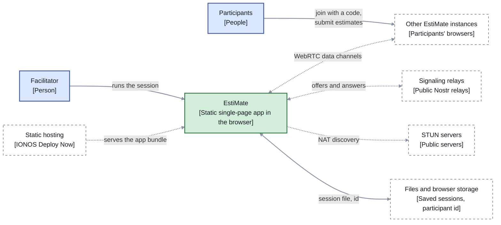
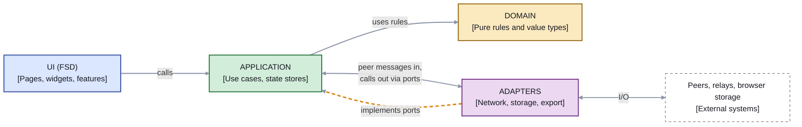
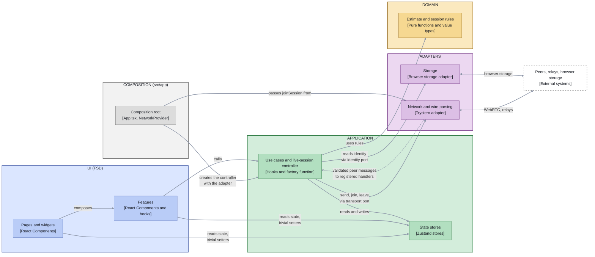

# EstiMate — Technical Architecture

**Status:** Accepted. Structured after [arc42](https://arc42.org); this is the living description of the current architecture.
**Based on:** [prd.md](prd.md), the design handoffs in `design_handoff_estimate_app/` and `design_handoffs/`, [ADR-001](adr/001-live-collaboration-architecture.md), [ADR-003](adr/003-session-reliability-model.md), [ADR-009](adr/009-architecture-style-fsd-vs-hexagonal-core.md)

Decisions and their history live in the [ADRs](adr/); implementation detail of single
topics lives in [concepts/](concepts/). This document is the map: it states how the system
is built today, holds the context view and the building-block views, and links out for the
rest. The words it uses are defined in the [glossary](glossary.md).

## 1. Introduction and goals

EstiMate is a live three-point estimation tool for dev teams. A team estimates a backlog
item by item, each member gives a best, most likely and worst case, and the app turns the
submissions into a range with a confidence interval and counters known estimation biases
([PRD](prd.md) §2).

| Goal | Meaning for the architecture |
|---|---|
| Estimate live, together, with no server we operate | Peer-to-peer sessions (ADR-001) on a static single-page app |
| A solo facilitator can use it too | Manual mode shares the estimation engine and the screens with Live mode |
| Defensible ranges, bias guards | The estimation engine is pure, framework-free and identical in both modes |
| Save and reopen a session later | Local-first, file-based persistence (section 8) |

Stakeholders: the facilitator, the participants, and the maintainers (Christian and Claude Code).

## 2. Constraints

| Constraint | Source |
|---|---|
| No backend operated by the product for live communication. Signaling uses public relays, NAT traversal uses public STUN servers | ADR-001, PRD §9 |
| Static SPA: React 19, TypeScript (`strict`, `noUncheckedIndexedAccess`), Vite, Zustand, `react-router`, Phosphor icons. oxlint lints (it is the `create-vite` default, equivalent for our needs) and Prettier formats | AGENTS.md, ADR-006 |
| Nocturne design system ported verbatim (`src/design/nocturne.css` is never edited, no Tailwind) | Section 9, product and design decisions |
| Last two versions of evergreen Chrome, Firefox, Safari and Edge | AGENTS.md |
| Solo-maintained: every change goes through a branch and a PR with required CI checks, Conventional Commit titles | AGENTS.md, [runbook](runbook.md) |

## 3. Context and scope

| Legend | Meaning |
|---|---|
| Solid arrow | A synchronous use or file access |
| Dotted arrow | Asynchronous network traffic or served content |
| Double arrow | Both directions |
| Dashed box | External system |

Edge labels say what crosses the edge.

| External party | Interface |
|---|---|
| Other EstiMate instances | Direct WebRTC data channels, typed wire actions (`adapters/network/actions.ts`). Every inbound message is untrusted ([trust boundary](concepts/collaboration-mode.md)) |
| Signaling relays | Trystero's Nostr strategy exchanges offers and answers. The e2e suite uses a local WebSocket relay instead (ADR-007) |
| STUN servers | Public servers for NAT traversal. No TURN server is operated (ADR-001) |
| Static hosting | Serves the built bundle, deployed by CI ([runbook](runbook.md)) |
| Files and browser storage | A stable per-browser participant id today, session files for save and load later |

## 4. Solution strategy

| Strategy | Decision |
|---|---|
| Hexagonal core with an FSD UI | Pure domain, application (use cases and stores), adapters for the outside world, and a Feature-Sliced Design UI. Dependencies point inward ([ADR-009](adr/009-architecture-style-fsd-vs-hexagonal-core.md), [ADR-004](adr/004-feature-sliced-design-architecture.md)) |
| Peer-to-peer live sessions | Trystero over WebRTC, no operated backend (ADR-001) |
| Facilitator owns the live state | Versioned rounds, a values-free submission roster, acknowledged submissions (ADR-003) |
| One estimation engine for both modes | `aggregateEstimates` is called with N submissions or one (section 8) |
| Three small stores | Session, connection and round state are separate Zustand stores (ADR-005) |
| Boundaries enforced by tools | Steiger for the UI, oxlint for the layer imports, type tests for the store views (section 5) |

## 5. Building block view

### Level 1: layers

Features and adapters may also use domain types directly; those edges are left out to keep the
diagram readable. The arrow from the UI to the application layer stands for both of its uses:
calling use cases and reading the stores. `src/app` (composition) sits beside the UI folders in
the FSD layer order but is the one place allowed to import an adapter, so the adapter box is wired
in there.

| Legend | Meaning |
|---|---|
| Solid arrow | A call, pointing at the callee. When the callee is an adapter, the call goes through an interface the application owns, so the source-code dependency still points inward |
| Double arrow | Calls in both directions |
| Dashed amber arrow | The adapter implements that interface, wired in at composition time |
| Dashed box | External system |

### Level 2: what is inside each layer

| Legend | Meaning |
|---|---|
| Solid arrow | A synchronous call or write, pointing at the callee |
| Double arrow | Both directions |
| Dotted arrow | An event or callback from an adapter |
| Dashed box | External system |
| `[type]` line | The kind of component, under its name |

Ports and the "implements" relationship appear in the level 1 view only.

| Box | Layer | Responsibility |
|---|---|---|
| **Estimate and session rules** | Domain | Everything pure: `Estimate` and its factory, aggregation, guards, uncertainty guidance, item and round types, roster, snapshot, resend and connection rules, label rules, the finalize rule. No React, no I/O. Keeps the 100% coverage threshold. |
| **Use cases and live-session controller** | Application | Submit, reveal, retry, finalize, join and leave, as straight-line code: read state, call a domain decision, write state, trigger an effect. The live-session controller (`createLiveSessionController`) owns one connection: connect, disconnect, send with retry, resend, snapshot pull, roster prune, announce, and the facilitator's snapshot broadcast when the stores change. It owns the ports the adapters implement, such as the peer transport (`ports/outbound/networkTransport.ts`). |
| **State stores** | Application | The Zustand stores holding session, round and connection state. The UI reads them with selectors and may call a few trivial field setters (session name, unit, item selection and text fields). Every other write goes through a use case. |
| **Network and wire parsing** | Adapters | The Trystero/WebRTC transport, signaling, and validation of untrusted peer messages into domain values. It implements the transport port, delivers validated messages to the handlers the controller registered, and never touches the stores. |
| **Storage** | Adapters | The stable per-browser participant id today. Save, load and export would be further adapters behind ports. |
| **Composition root** | Composition | `App.tsx` provides the identity port, `NetworkProvider.tsx` creates the controller with the network adapter and provides it to the UI. The one place that imports both an adapter and the application's composition entry. |
| **Features** | UI | UI-only features and their components. They call use cases and add navigation. |
| **Pages and widgets** | UI | Screens and widgets composed from features and shared UI, plus routing (ADR-006) and the design system. |
| **Peers, relays, browser storage** | External | Not part of the codebase. |

### Where things live

| Part | Location |
|---|---|
| Domain | `src/domain` (rules and types), `src/domain/estimate` (the estimation engine, formerly `/calc`) |
| Application | `src/application`: `stores/` (session, connection, round, plus the narrowed `publicStores`), `useCases/` (including the live-session controller), `ports/` and `ports/outbound/` (the peer transport), `composition.ts` and `testing.ts` (entries for `src/app` and tests only), `index.ts` (the barrel the UI imports) |
| Adapters | `src/adapters/network` (Trystero transport, wire actions and parsing, signaling), `src/adapters/storage` (participant id) |
| Composition | `src/app`: `App.tsx` provides the identity port, `NetworkProvider.tsx` is the thin React shell that wires the network adapter into the live-session controller |
| UI | `src/pages`, `src/widgets`, `src/features`, `src/entities` (`item`, `estimate`), `src/shared`. The slice mapping is in ADR-004 and the placement helper is `.claude/skills/fsd-architecture` |
| Styling | `src/design` holds the verbatim Nocturne port and generic composed patterns, component CSS sits beside its component |

### Rules

These are the architecture rules. Each has an ID so that scanners, the review agent and the
skill can cite it.

| ID | Rule | Enforced by |
|---|---|---|
| R1 | The domain imports nothing outside itself, uses no I/O globals, and only test files import `vitest`. It keeps 100% test coverage | oxlint override on `src/domain/**`, coverage threshold in `vite.config.ts` |
| R2 | The application layer imports the domain and itself. It may use React and Zustand, but no UI layer, router, transport library or adapter | oxlint override on `src/application/**` |
| R3 | Adapters import the domain, other adapters and packages other than React, Zustand and the router. From the application they import only `application/ports/outbound/**` | oxlint override on `src/adapters/**` |
| R4 | Inside the UI, imports point downward (`app`, `pages`, `widgets`, `features`, `entities`, `shared`), and a slice is reached only through its `index.ts` | Steiger (`pnpm arch`) |
| R5 | The UI folders (`pages`, `widgets`, `features`, `entities`, `shared`) never import an adapter. They import the application only through `src/application/index.ts`. The `composition` and `testing` entries are for `src/app` and test files only | oxlint overrides on the UI folders |
| R6 | Only `src/app` (the composition root) imports an adapter next to the application. It is the one exception to R5 | R5 together with R2 |
| R7 | The UI reads store state through selectors on read-only views and may call only the trivial field setters. Every rule-bearing write goes through a use case | Type tests on the exported views (`publicStores.test.ts`), R5 |
| R8 | Store action or use case: code that reaches another store, calls a port or triggers an effect is a use case. Stores do not reach into each other, except the round store writing items through `patchItem` (ADR-005) | `architecture-review` agent |
| R9 | Ports exist only at real external boundaries (peer transport, identity and storage) and are owned by the application layer | `architecture-review` agent |
| R10 | Pure decisions live in the domain as unit-tested functions, never inline in stores, use cases, adapters or components | `architecture-review` agent, domain coverage |
| R11 | A relative `vi.mock` target must resolve, so a moved module cannot leave a stale mock | `src/viMockPaths.test.ts` |

The oxlint rules are path-based and rely on relative imports (there are no path aliases).

## 6. Runtime view

| Scenario | Where it is described |
|---|---|
| Join a live session, participant and facilitator sides | [collaboration-mode](concepts/collaboration-mode.md): join sequence |
| Estimate round, reveal, retry, finalize | [collaboration-mode](concepts/collaboration-mode.md): estimate round and facilitator reveal |
| Late join and reconnect: the snapshot pull | [collaboration-mode](concepts/collaboration-mode.md): snapshot pull on connect and reconnect |
| Connection states and what a participant is told | [collaboration-mode](concepts/collaboration-mode.md): connection state machine |
| End-to-end flows under test | [e2e-testing](concepts/e2e-testing.md) |
| Single-user estimate and finalize | The same use cases without the live-session controller: `finalizeEstimate` aggregates one estimate with the shared engine |

## 7. Deployment view

The app is a static bundle. CI builds and checks it on every pull request and on `main`, and the
IONOS Deploy Now pipeline publishes `main`. There is no server-side component. The e2e suite runs
against a locally self-hosted signaling relay by default and against the public relays nightly
([ADR-007](adr/007-e2e-dual-mode-signaling.md)). Pipeline, secrets and releases are in the
[runbook](runbook.md).

## 8. Crosscutting concepts

| Concept | Summary | Detail |
|---|---|---|
| Estimation engine | One aggregation function for both modes (min of best, median of likely, max of worst, McConnell's CI90), bias guards that return structured signals, and `Estimate` as a self-validating value type created only through `createEstimate` | [estimation-engine](concepts/estimation-engine.md) |
| Live sync | Room id is the 6-character session code (Crockford base32, no deep link) under the fixed `appId` `estimate-app-v1`. Trystero's Nostr strategy is the default (the library's own robustness ranking is Nostr, MQTT, BitTorrent, IPFS, and the Supabase and Firebase strategies need your own project). A self-hosted WebSocket relay is the escape hatch. An optional room password AES-GCM-encrypts the signaling handshake, without it the room id is visible as metadata on the relay. The facilitator's items are the single source of truth: participants send estimates only to the facilitator, and everyone else receives `syncState` snapshots. A peer that connects or reconnects pulls the snapshot itself (`requestSnapshot`) | ADR-001, ADR-003, [collaboration-mode](concepts/collaboration-mode.md) |
| Reliability | Versioned rounds, a values-free roster, acknowledged submissions with a kind-driven retry policy, a stable per-browser participant id, role-asymmetric link state | ADR-003 |
| Trust boundary | Every inbound peer message is validated into domain values at the adapter edge, so the UI only sees valid `Estimate`s | [collaboration-mode](concepts/collaboration-mode.md): trust boundary |
| State and UI access | Three stores in the application layer, read-only narrowed views for the UI, use cases for rule-bearing writes (R7, R8) | ADR-005, ADR-009 |
| Navigation | `react-router`. Use cases contain no navigation, `features/session-lifecycle` wraps them with it | ADR-006 |
| Persistence | Local-first and file-based. A session (name, unit, items) is saved as a JSON file and restored from one, live-round fields are excluded. Save is a read-only export available to the facilitator in either mode. Load is allowed only before a live session starts, because importing mid-session would silently replace the facilitator's items and desync participants, so a facilitator resumes an adjourned session from the mode-select screen. A participant never has a local item list. A session survives only if the user saves the file, and the UI must say so plainly. No accounts, no cross-device sync in the MVP. Not built yet | PRD §8 |
| Estimation unit | The facilitator picks hours, days or weeks per session. The false-precision guard's rounding granularity derives from the unit through a lookup, and the unit travels on `SessionSnapshot`, which is how the participant view receives it | [estimation-engine](concepts/estimation-engine.md) |
| Testing | Unit and component tests, a thin Playwright layer for real WebRTC, type tests for the store views, 100% coverage on the domain | ADR-002, ADR-007, [e2e-testing](concepts/e2e-testing.md) |
| Accessibility | oxlint `jsx-a11y`, `jest-axe` scans, `@axe-core/playwright` scans, a tracked `color-contrast` exclusion | ADR-008 |
| Styling and shared UI | Nocturne is the single source of tokens and components. `shared/ui` holds thin wrappers over Nocturne classes (Button, Card, Field, Markdown and MarkdownEditor, LiveRegion, and so on). `Header` lives in `app/` because it carries screen and mode-aware logic. `RadioTile` is unused but kept as a design-system primitive. Composed patterns sit in their own files in `src/design`, and component CSS sits beside its component | Section 9, product and design decisions |

## 9. Architecture decisions

| ADR | Decision |
|---|---|
| [001](adr/001-live-collaboration-architecture.md) | Peer-to-peer WebRTC for Live mode, Manual mode as a first-class fallback |
| [002](adr/002-testing-strategy.md) | Layered tests with a thin Playwright layer |
| [003](adr/003-session-reliability-model.md) | Facilitator-authoritative rounds and reliable delivery |
| [004](adr/004-feature-sliced-design-architecture.md) | Feature-Sliced Design as the enforced UI architecture (the UI part is still current) |
| [005](adr/005-session-store-decomposition.md) | Three per-concern stores |
| [006](adr/006-router-adoption.md) | `react-router` replaces hand-rolled navigation |
| [007](adr/007-e2e-dual-mode-signaling.md) | Local relay for e2e by default, public relays nightly |
| [008](adr/008-accessibility-testing-strategy.md) | Three-layer automated accessibility checks |
| [009](adr/009-architecture-style-fsd-vs-hexagonal-core.md) | Hexagonal core with an FSD UI, extracted in stages 1 to 3d (done) |

Product and design decisions that have no ADR:

| Decision | Reason |
|---|---|
| No authentication, open links | Consistent with local-first. Anyone with a link can join, so a link is access |
| No mode switching mid-session | If the live connection fails, the facilitator starts a fresh single-user session |
| Estimation unit is set per session (hours, days or weeks), not per item | Resolves the PRD example (days) against the prototype (weeks). A native `<select>` in the Workspace sidebar |
| Nudge styling for the symmetric-range and false-precision guards uses the plain `.card-meta` caption | No distinct pattern exists in Nocturne, a design pass is a fast-follow |
| Nocturne is ported as-is, no Tailwind | Its values are hand-tuned (non-round spacing, OKLCH ramps), a second config would drift from `nocturne.css` |

## 10. Quality requirements

| Quality | Scenario | How it is met |
|---|---|---|
| Correctness | The same inputs give the same range in both modes | One pure engine, 100% domain coverage |
| Reliability | A dropped link or late join still ends on the right view | Snapshot pull, retry policy, versioned rounds (ADR-003), real-WebRTC e2e tests |
| Privacy | A participant never sees another's values before the reveal | Targeted sends to the facilitator, a values-free roster |
| Zero operations | No server to run or pay for | Static hosting, public relays and STUN |
| Accessibility | Keyboard and screen-reader use of the estimate flow | ADR-008 |
| Maintainability | A new feature has an obvious home, a boundary violation fails CI | Rules R1 to R11, the placement skill, the review agent |

## 11. Risks and technical debt

Work items are tracked on the EstiMate Roadmap board.

| Item | Note |
|---|---|
| Facilitator disconnect stalls the session | Accepted MVP gap, no election or reassignment |
| Mesh topology | Direct peer connections suit small groups, which is the normal estimation session size |
| Session save and load, CSV export and the shareable link are not built | The `session-history` page is slated for removal, not real persistence |
| Connection-fallback UX for peers that cannot connect directly | Not built |
| Outlier flag | `checkOutlier` exists in the domain but nothing in the reveal panel uses it |
| The Session Summary rows carry no unit suffix | Small gap in unit-aware labels |
| `AggregateStrategy` is an engineering default, not a facilitator setting | Needs a schema field and UI if teams want it |
| Guard thresholds (symmetric range 15%, outlier 40%) are untuned constants | Retune after real sessions |
| Live participants can open `/workspace` | A route guard in `app/` is planned, no domain rule is needed |
| The round is written in several places | A round state machine (ADR-009, option D) is a separate, deferred decision |
| Layer rules are path-based oxlint patterns | Hand-maintained and probed once. A dependency-cruiser spike is planned to compare |

## 12. Glossary

See [glossary.md](glossary.md): layer, type, aggregate, entity, value object, inbound and outbound
adapter, port, use case, state store, live-session controller, FSD slice and segment, and the words
to avoid.
