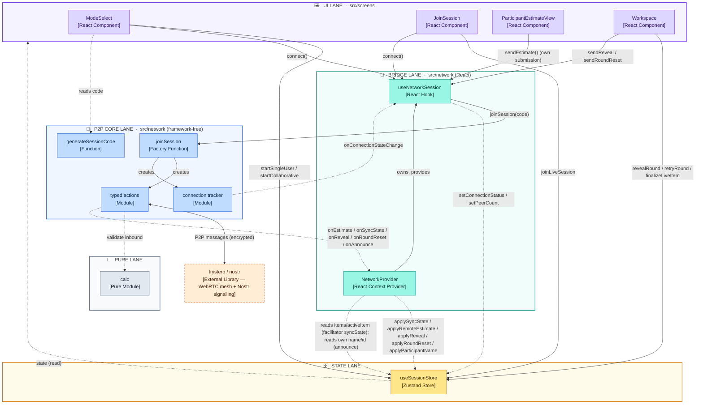
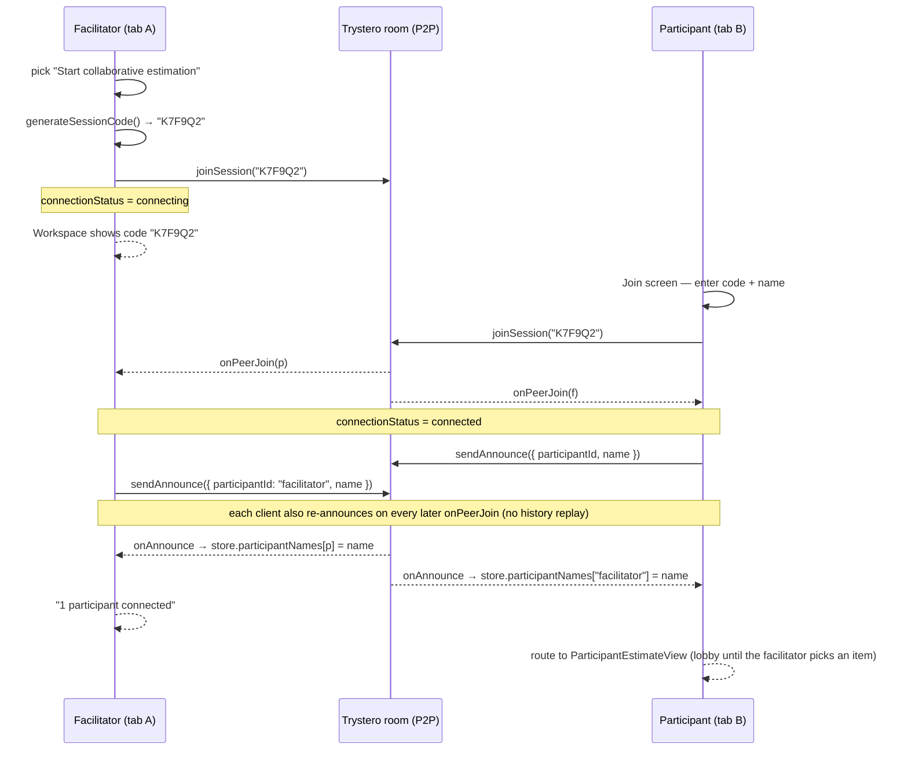
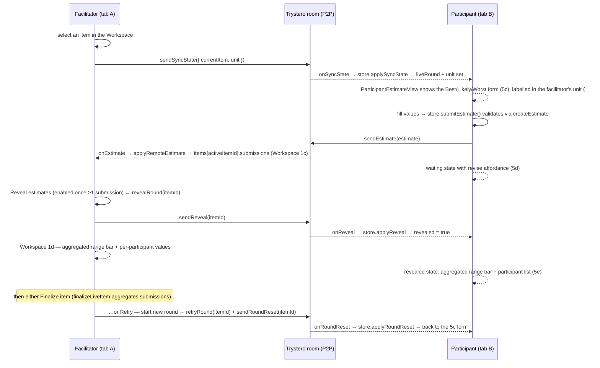
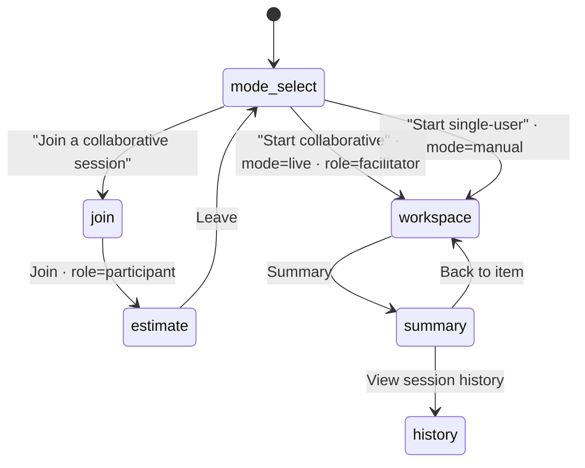
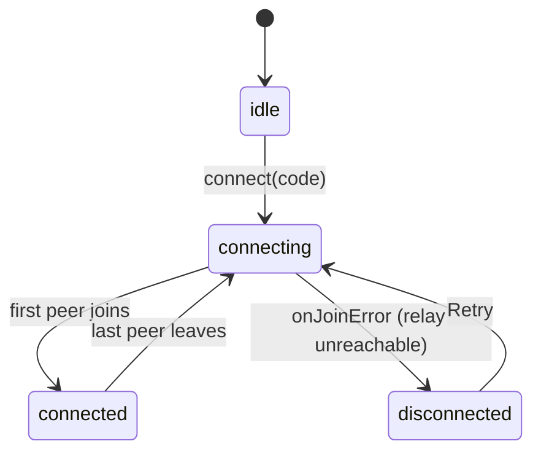

# Live Collaboration Mode — Technical Concept

## Overview

EstiMate has two session modes. **Manual mode (Mode B)** is single-user, in-memory, and
already built. **Live mode (Mode A)** lets named participants join a facilitator's session
over a serverless peer-to-peer mesh (Trystero over WebRTC, Nostr relays for signaling only)
and submit private three-point estimates that are revealed together. There is **no backend** —
every peer runs the same code and computes aggregates locally.

This document covers the join flow (#6, updated for the #34 mode-select / Workspace
entry-flow rebuild), the participant estimate round (#7), the `announce` action that
carries participant display names (#40), and the facilitator reveal / retry round (#8) —
Workspace states 1c (waiting for estimates) → 1d (revealed), carried over the wire by the
`reveal` and `roundReset` actions.

## Component view

Level-3 (component) view. Each box carries its `[type]`; responsibilities are in the table
below. Lanes are the source directories. Lines: **solid** = synchronous call,
**dotted** = asynchronous callback / event / read, `<-->` = bidirectional.

### Component responsibilities

| Component | Type | Responsibilities |
|---|---|---|
| **ModeSelect** | React Component | The entry screen: three rows — start single-user, start collaborative, join. On "start collaborative": reads a code from `generateSessionCode`, calls `startCollaborative(code)` (which sets `mode` / `role` / `sessionId` and routes to the Workspace), then `connect()`. "Join" routes to the Join screen. |
| **JoinSession** | React Component | Collects session code + participant name (name required — no anonymous peers). Calls `joinLiveSession()` then `connect()`. Renders connecting / connected / disconnected states from `store.connectionStatus`, including the failure banner + Retry. |
| **ParticipantEstimateView** | React Component | The participant's whole round (#7), driven by `store.liveRound`: a lobby before the facilitator picks an item, then the Best/Likely/Worst form with live bias guards (5c), a waiting state showing the submitted values with a revise affordance (5d), and a revealed state with the aggregated range bar + per-participant list (5e). No finalize/retry — those are facilitator-only. Submitting calls `store.submitEstimate()` then broadcasts the validated estimate via `useNetworkSession().sendEstimate`. |
| **Workspace** | React Component | The single working screen for both modes: session-name / unit / item-list sidebar plus the active item's estimate panel (or an empty state). In Live mode additionally renders the session-code strip (with copy button), the "N participants connected" count, and a connection-status `Tag`. For a **facilitator** in Live mode the manual B/L/W inputs are replaced by the reveal panel: state 1c lists each participant as `Submitted` / `Waiting` and gates a **Reveal estimates** button on `submissions.length >= 1`; state 1d shows the aggregated range bar + per-participant values with **Finalize item** (`finalizeLiveItem`) and **Retry — start new round** (`retryRound` + `sendRoundReset`). Reveal calls `revealRound` + `sendReveal`. |
| **useSessionStore** | Zustand Store | Single source of truth for session state: `mode`, `role`, `sessionId`, `myName`, `participantId`, `connectionStatus`, `peerCount`, items, current screen. **Participant** clients hold `liveRound` (the facilitator's current item + received submissions + revealed flag + own submission), updated by `applySyncState` / `applyRemoteEstimate` / `applyReveal` / `applyRoundReset` / `submitEstimate`; `applySyncState` additionally adopts `snapshot.unit` into `store.unit`. **Facilitator** clients instead accumulate each round on the `Item` itself — `applyRemoteEstimate` upserts inbound submissions onto `items[activeItemId].submissions` (ignored once the item is `revealed` or finalized), `revealRound` / `retryRound` flip `items[].revealed`, and `finalizeLiveItem` aggregates `items[].submissions` into `finalResult`. Type-only import of `SessionSnapshot` from `src/network/actions`; no runtime `src/network` import. |
| **NetworkProvider** | React Context Provider | Wraps `<App>`. Owns the one `NetworkSession` instance for the app's lifetime and exposes it via `useNetworkSession`; tears it down on unmount. On `connect` it also dispatches inbound `onEstimate` / `onSyncState` / `onReveal` / `onRoundReset` / `onAnnounce` into the store, and (facilitator only) subscribes to the store to broadcast a `syncState` whenever the active item, estimation unit, or finalized set changes. It also broadcasts the local client's own `announce` on connect and re-announces on every peer join, and applies inbound announces via `applyParticipantName`. The `NetworkSessionApi` it provides adds `sendReveal(itemId)` / `sendRoundReset(itemId)` alongside `sendEstimate`. |
| **useNetworkSession** | React Hook | The only code that touches both the store and the P2P core. `connect(sessionId)` calls `joinSession()` and subscribes to its events; `disconnect()` calls `leave()`; `sendEstimate(estimate)` forwards a participant's submission to the room; `sendReveal(itemId)` / `sendRoundReset(itemId)` broadcast the facilitator's reveal / new-round signals. Mirrors `onConnectionStateChange` and peer join/leave into the store. (The participant name is put in the store by `joinLiveSession()` before `connect()` runs.) |
| **joinSession** | Factory Function | Entry point of the P2P core (from PR #25). Opens the Trystero room (`roomId = sessionId`), wires up the connection tracker and typed actions, returns a `NetworkSession` of `send*` / `on*` methods. |
| **typed actions** | Module | Defines the five wire actions (`submitEstimate`, `syncState`, `reveal`, `roundReset`, `announce`), serialises outbound messages, and validates every inbound message (through `calc` for estimates; shape checks for the rest — `reveal` and `roundReset` payloads must be strings) before surfacing it. `announce` carries a `participantId -> display name` pair, kept off the pure `Estimate` type. |
| **connection tracker** | Module | State machine over peer join/leave and join errors → `idle` / `connecting` / `connected` / `disconnected` plus the peer list; notifies subscribers on change. |
| **generateSessionCode** | Function | Returns a 6-char Crockford-base32 code (crypto RNG, ambiguous characters removed), used as both the shareable code and the Trystero room id. |
| **calc** | Pure Module | Existing framework-free math (`createEstimate`, `aggregateEstimates`, `computeCI90`, guards). Used here only to validate inbound peer estimates. |
| **trystero/nostr** | Library (external) | Third-party. Establishes the WebRTC peer mesh and uses Nostr relays for signalling only — no session data is stored on any relay. |

## Join sequence (#6)

## Estimate round (#7)

## Screen flow

`ScreenId` is `mode-select | workspace | join | estimate | summary | history` (the #34
redesign replaced `create` / `session` with `mode-select` / `workspace`; reveal is no
longer a screen — it's Workspace states 1c/1d, #8). The diagram writes ids as
`mode_select` / `workspace` because Mermaid state ids can't contain `-`.

## Connection state machine

Mirrored from `src/network`'s connection tracker into `store.connectionStatus`:

`disconnected` drives the Join screen's plain-language failure banner + guidance
(retry / VPN / facilitator switches to Manual) per PRD §4.1 step 8. The full
connection-fallback UX is #9.

## Store additions

| Field | Purpose |
|---|---|
| `mode: 'manual' \| 'live'` | set by the mode-selection screen; selects the flow |
| `role: 'facilitator' \| 'participant'` | defaults to `facilitator`; Join flips it to `participant` |
| `sessionId: string \| null` | the shared 6-char code = Trystero room id |
| `myName: string` | participant display name (named, never anonymous) |
| `participantId: string` | stable per-join id (`crypto.randomUUID()`), the submission key |
| `connectionStatus` | `idle \| connecting \| connected \| disconnected` |
| `peerCount: number` | connected peers, for the facilitator strip |
| `liveRound: LiveRound \| null` | participant-only: current item + received `submissions` + `revealed` flag + own `mySubmission`; written by `applySyncState` / `applyRemoteEstimate` / `applyReveal` / `applyRoundReset` / `submitEstimate` |
| `Item.submissions: Estimate[]` | facilitator-only: submissions received for the current round on that item, upserted by `applyRemoteEstimate`, cleared by `retryRound` (#8). Always empty in single-user mode. |
| `Item.revealed: boolean` | facilitator-only: whether the round on that item is revealed (Workspace 1c → 1d). Set by `revealRound`, cleared by `retryRound` (#8). |
| `participantNames: Record<string, string>` | `participantId -> display name` for every announced client (own entry seeded on join / start; peers filled in by `applyParticipantName` from inbound `announce`). Lets the participant reveal list and the facilitator's 1c/1d roster show real names instead of "Teammate N". Reset on leave. |
| `unit` (participant) | on every `applySyncState` the participant's `store.unit` is overwritten with the facilitator's `snapshot.unit`, so its estimate form and bars label values in the session's unit (#39) |

## Trust boundary

Every inbound peer message crossing `trystero/nostr → src/network/actions` is untrusted:
`submitEstimate` re-runs `createEstimate` (drop on failure), `syncState` is shape-checked
(including `unit` against the known set — an unknown/missing unit drops the whole snapshot)
and each submission re-validated, `reveal` and `roundReset` must each be a string, `announce` must be an object
with a non-empty `participantId` string and a `name` string that is non-empty after
trimming (the name is trimmed before it reaches the store). The UI only ever sees validated
`Estimate` values.

## Known MVP gaps (accepted)

- No TURN server — participants behind symmetric NAT can't connect; Manual mode is the
  fallback.
- Facilitator disconnect mid-session stalls the session (no facilitator re-election).
- Mode is fixed at creation — no mid-session switch.
- Estimation unit is broadcast and re-broadcast on change (#39), but a mid-round change
  only re-labels values — already-submitted numbers are not converted and participants are
  not prompted to re-enter. Treat unit as a set-once-per-session choice.
- Late-joiner snapshot uses `syncState` broadcast (hits all peers), wired in #7.
- No `/join/<id>` deep links yet — code is shared out of band.
- No peer-identity binding: `submitEstimate` and `announce` are both keyed purely on the
  `participantId` in the payload, not on the sending peer, so a hostile peer could submit
  or rename under someone else's id. Trystero encryption keeps outsiders out; there's no
  defence against a malicious participant inside the room. Inbound names are shape-checked
  and length-capped (`MAX_ANNOUNCE_NAME_LENGTH`), not authenticated.
