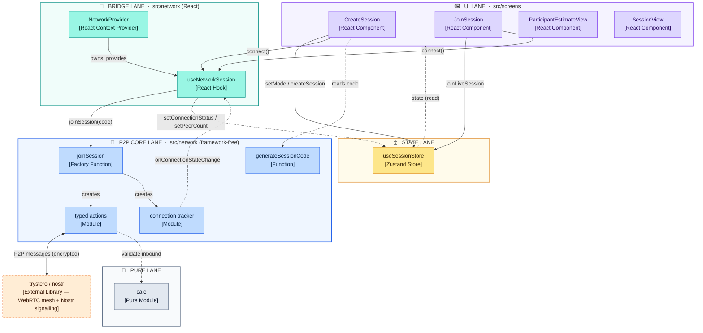
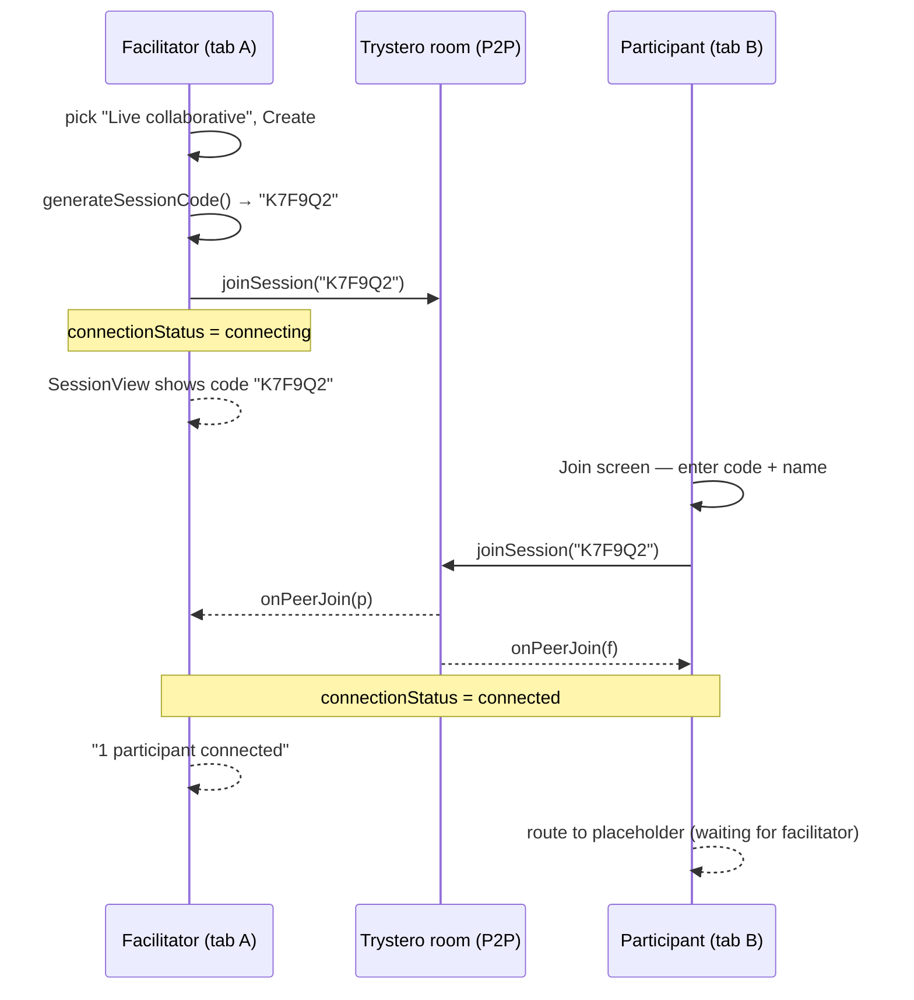
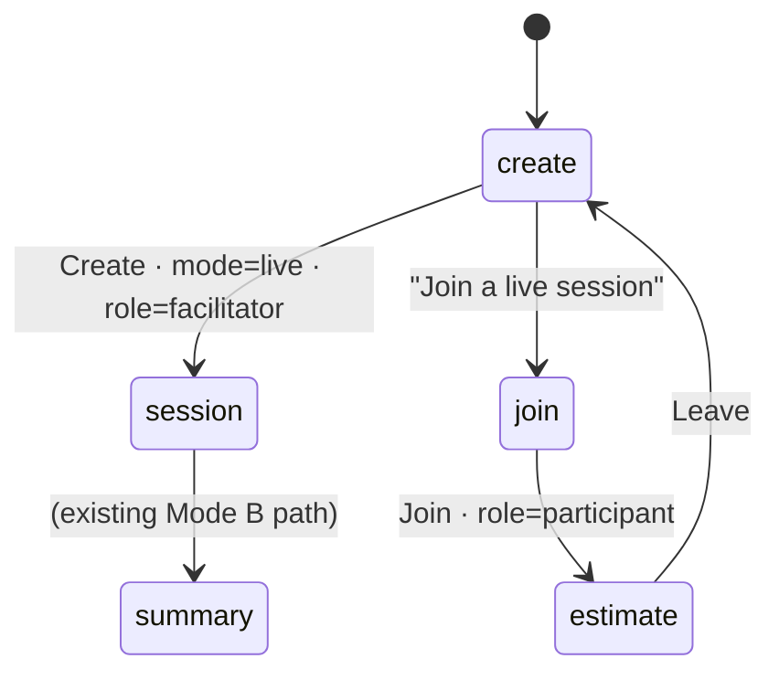
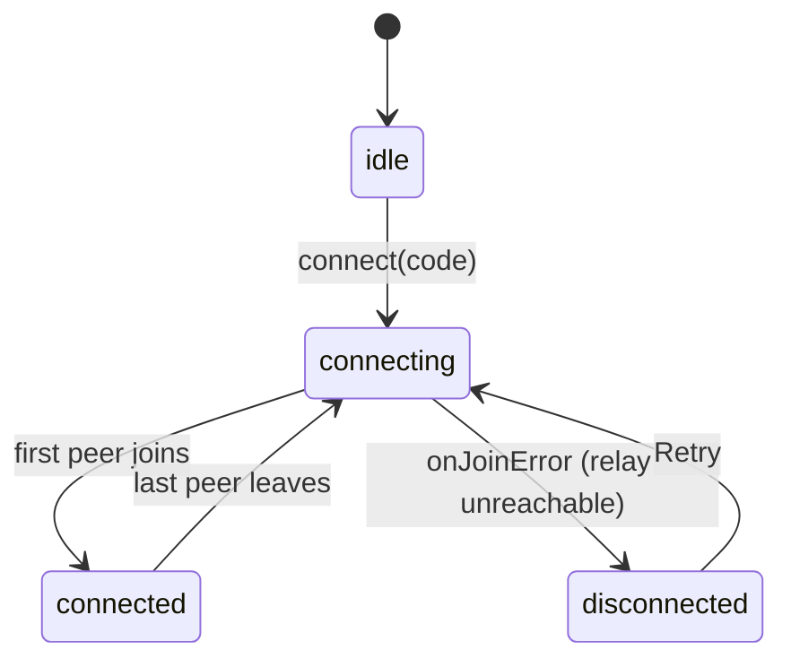

# Live Collaboration Mode — Technical Concept

## Overview

EstiMate has two session modes. **Manual (Mode B)** is single-user, in-memory, and already
built. **Live (Mode A)** lets named participants join a facilitator's session over a
serverless peer-to-peer mesh (Trystero over WebRTC, Nostr relays for signaling only) and
submit private three-point estimates that are revealed together. There is **no backend** —
every peer runs the same code and computes aggregates locally.

This document covers the foundation delivered with issue #6 (join flow + wiring); the
estimate round (#7) and reveal (#8) build on the same structures.

## Component view

Level-3 (component) view. Each box carries its `[type]`; responsibilities are in the table
below. Lanes are the source directories. Lines: **solid** = synchronous call,
**dotted** = asynchronous callback / event / read, `<-->` = bidirectional.

### Component responsibilities

| Component | Type | Responsibilities |
|---|---|---|
| **CreateSession** | React Component | Renders the new-session form and the Manual/Live mode picker (`RadioTile` ×2). On Live create: reads a code from `generateSessionCode`, sets `mode` / `role` / `sessionId` in the store, calls `connect()`. Offers the "Join a live session" link. |
| **JoinSession** | React Component | Collects session code + participant name (name required — no anonymous peers). Calls `joinLiveSession()` then `connect()`. Renders connecting / connected / disconnected states from `store.connectionStatus`, including the failure banner + Retry. |
| **ParticipantEstimateView** | React Component | #6 placeholder: shows "waiting for the facilitator", connection status, and Leave. Replaced by the real three-input estimate form in #7. |
| **SessionView** | React Component | Existing facilitator / Manual-mode screen. In Live mode additionally renders the session-code strip (with copy button), the "N participants connected" count, and a connection-status `Tag`. |
| **useSessionStore** | Zustand Store | Single source of truth for session state: `mode`, `role`, `sessionId`, `myName`, `connectionStatus`, `peerCount`, items, current screen. Never imports `src/network`. |
| **NetworkProvider** | React Context Provider | Wraps `<App>`. Owns the one `NetworkSession` instance for the app's lifetime and exposes it via `useNetworkSession`; tears it down on unmount. |
| **useNetworkSession** | React Hook | The only code that touches both the store and the P2P core. `connect(code, name)` calls `joinSession()` and subscribes to its events; `disconnect()` calls `leave()`. Mirrors `onConnectionStateChange` and peer join/leave into the store. |
| **joinSession** | Factory Function | Entry point of the P2P core (from PR #25). Opens the Trystero room (`roomId = sessionId`), wires up the connection tracker and typed actions, returns a `NetworkSession` of `send*` / `on*` methods. |
| **typed actions** | Module | Defines the three wire actions (`submitEstimate`, `syncState`, `reveal`), serialises outbound messages, and validates every inbound message through `calc` before surfacing it. |
| **connection tracker** | Module | State machine over peer join/leave and join errors → `idle` / `connecting` / `connected` / `disconnected` plus the peer list; notifies subscribers on change. |
| **generateSessionCode** | Function | Returns a 6-char Crockford-base32 code (crypto RNG, ambiguous characters removed), used as both the shareable code and the Trystero room id. |
| **calc** | Pure Module | Existing framework-free math (`createEstimate`, `aggregateEstimates`, `computeCI90`, guards). Used here only to validate inbound peer estimates. |
| **trystero/nostr** | Library (external) | Third-party. Establishes the WebRTC peer mesh and uses Nostr relays for signalling only — no session data is stored on any relay. |

## Join sequence (#6)

## Screen flow

`ScreenId` gains `join` and `estimate` (not `reveal` until #8).

## Connection state machine

Mirrored from `src/network`'s connection tracker into `store.connectionStatus`:

`disconnected` drives the Join screen's plain-language failure banner + guidance
(retry / VPN / facilitator switches to Manual) per PRD §4.1.8.

## Store additions (foundation)

| Field | Purpose |
|---|---|
| `mode: 'manual' \| 'live'` | set by the picker; selects the flow |
| `role: 'facilitator' \| 'participant'` | defaults to `facilitator`; Join flips it to `participant` |
| `sessionId: string \| null` | the shared 6-char code = Trystero room id |
| `myName: string` | participant display name (named, never anonymous) |
| `connectionStatus` | `idle \| connecting \| connected \| disconnected` |
| `peerCount: number` | connected peers, for the facilitator strip |

Deferred: `submissions` / rounds (#7), `revealedItemIds` + per-participant view (#8).

## Trust boundary

Every inbound peer message crossing `trystero/nostr → src/network/actions` is untrusted:
`submitEstimate` re-runs `createEstimate` (drop on failure), `syncState` is shape-checked and
each submission re-validated, `reveal` must be a string. The UI only ever sees validated
`Estimate` values.

## Known MVP gaps (accepted)

- No TURN server — participants behind symmetric NAT can't connect; Manual mode is the
  fallback.
- Facilitator disconnect mid-session stalls the session (no host re-election).
- Mode is fixed at creation — no mid-session switch.
- Late-joiner snapshot uses `syncState` broadcast (hits all peers), wired in #7.
- No `/join/<id>` deep links yet — code is shared out of band.
