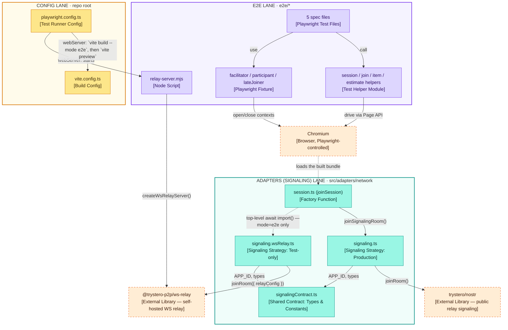
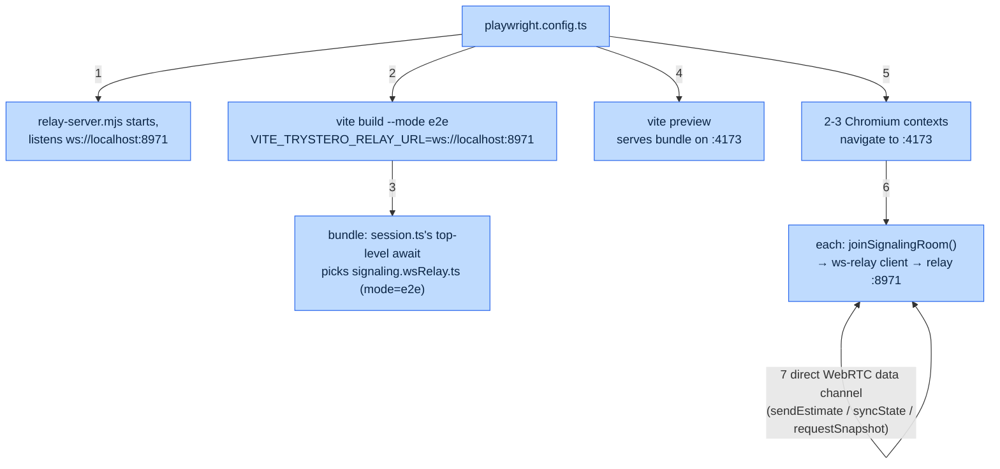
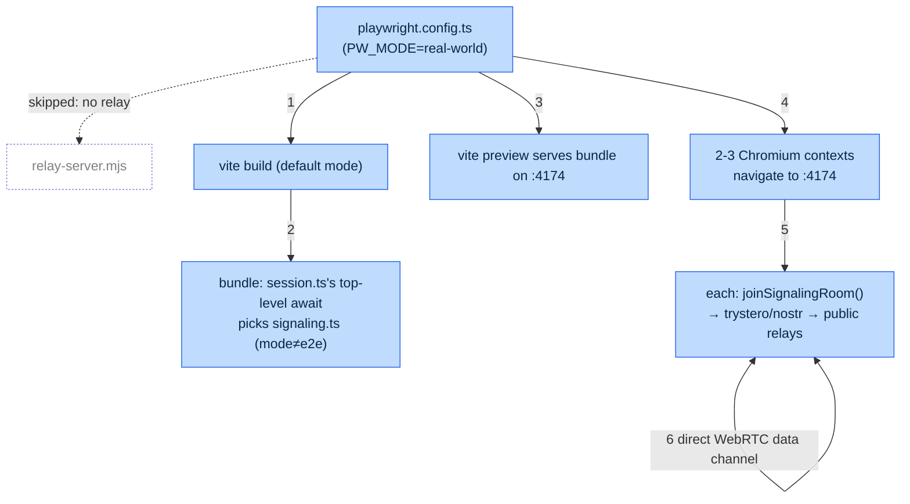

# Live Collaboration E2E Testing — Technical Concept

## Overview

Five Playwright specs (`e2e/specs/*.spec.ts`) drive real, separate browser contexts
against a real built app. Four exercise WebRTC connection behavior no unit/jsdom test
can reach; a fifth (`accessibility.spec.ts`) runs real-browser `@axe-core/playwright`
scans against the app's main screens — see [ADR-008](../adr/008-accessibility-testing-strategy.md)
for why that needs a real browser rather than the jsdom-based component tests. Signaling
is swappable at build time between a locally self-hosted relay (default) and the
production Nostr strategy ("real-world" mode).

This doc covers what exists and how it's wired. [ADR-007](../adr/007-e2e-dual-mode-signaling.md)
is the decision record — why dual-mode, why this relay, why blocking CI. This doc is
scoped to the e2e/Playwright layer specifically; the broader QA/guardrails system
(oxlint, Steiger, knip, hooks, CI layering) is tracked separately (#114).

## Component view

Structural only — no mode-specific behavior here (see the two flow diagrams below for
that). Lines: **solid** = import/call, **dotted** = build-time/config-time wiring.

`session.ts` resolves the top-level `await import(...)` once, at module init — not per
`joinSession()` call — so `joinSession` itself stays synchronous. One accepted side
effect: `signaling.ts` (the production strategy) is now its own lazily-loaded chunk,
fetched on the first `joinSession()` call rather than bundled eagerly (see ADR-007).

## Default (local relay) build & run flow

## Real-world build & run flow

## Fixture roles

| Fixture | Browser context | Represents |
|---|---|---|
| `facilitator` | own context | Creates the session, holds the Workspace/reveal view |
| `participant` | own context | Joins via code, submits estimates |
| `lateJoiner` | own context | Joins mid-round, exercises `requestSnapshot` pull-on-arrival |

Separate contexts (not tabs) because `JoinSession`'s own identity warning — "joining
from another tab in this browser will be treated as the same person" — means
same-context pages would collide on `participantId`; contexts have isolated storage.

## Spec → wire-action coverage

| Spec | Exercises | Not covered here (stays unit-level) |
|---|---|---|
| `create-and-join` | `joinSession`, `onPeerJoin`, `sendAnnounce`/`onAnnounce` | payload validation, retry/backoff timing |
| `submit-and-reveal` | `sendEstimate`/`onEstimate` (request/ack), reveal → `syncState` broadcast | malformed-estimate rejection, ack timeout handling |
| `sync-state-propagation` | `syncState` broadcast (item change, unit change) | snapshot field-level tolerance/defaults |
| `late-joiner-snapshot` | `requestSnapshot`/`onRequestSnapshot` (ADR-003 pull-on-arrival) | stale-round rejection, roster sanitization |

`accessibility.spec.ts` isn't in this table — it scans screens for WCAG violations
(ADR-008), not wire actions, so it's out of scope for this coverage map.

## CI

| Job | Mode | Gates merge? | Trigger |
|---|---|---|---|
| `e2e` (`ci.yml`) | local relay | Yes — in `ci-passed` | every PR / push to `main` |
| `e2e-real-world` (`e2e-real-world.yml`) | production Nostr | No | nightly + manual |

## Operational notes

- **Ports are per mode** (`:4173` local relay, `:4174` real-world) so that, with
  `reuseExistingServer` on locally, one mode can never silently reuse the other's
  still-running build. The relay listens on `:8971`.
- **A busy relay port fails loudly**: `relay-server.mjs` exits non-zero with a message
  naming the port conflict, instead of an unhandled rejection and a Playwright timeout.
- **Specs run in parallel** (2 workers in CI, local default otherwise). Each spec
  generates its own session code, so its Trystero room is disjoint from every other
  spec's on the shared relay.
- **A misconfigured e2e build fails at load**: `signaling.wsRelay.ts` throws on import if
  `VITE_TRYSTERO_RELAY_URL` is unset, rather than on the first Join click.
- **CI setup is shared**: both e2e workflows use `.github/actions/setup-e2e`, which also
  caches Playwright's Chromium keyed on the Playwright version.
