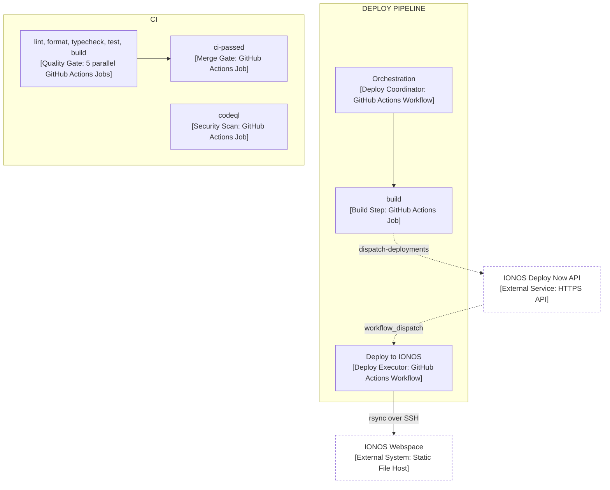
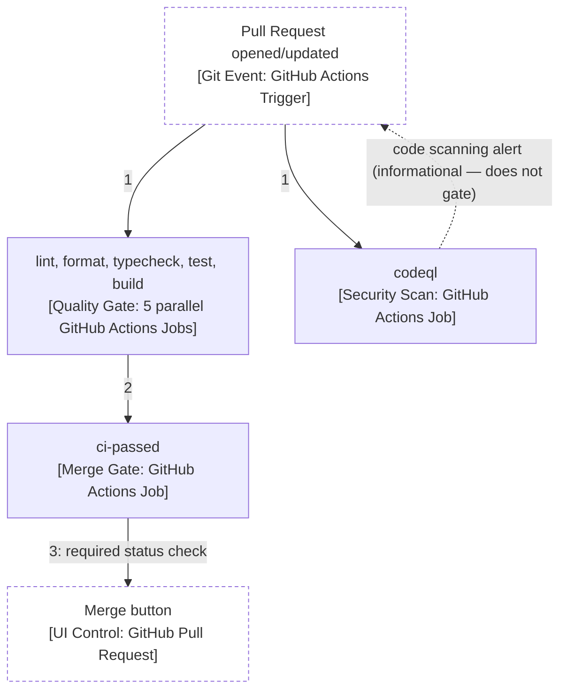
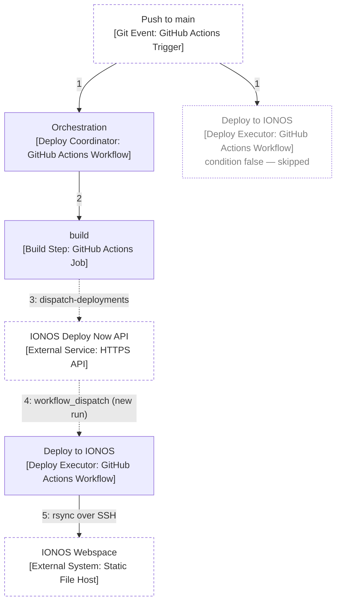

# Deployment & release runbook

EstiMate is a static site with no backend — build once, publish the bundle. Hosting
and CD are handled by **IONOS Deploy Now**, a GitHub-integrated static host: pushes
to `main` trigger a build and publish automatically, no server to operate.

## Pipeline

### Structure

What exists and what it depends on — no triggers, just dependencies.

*Legend: solid = synchronous call, dotted = async event/dispatch.*

### Flow: Pull Request opened/updated

The path that actually gates a merge.

### Flow: Push to main

Post-merge — this is what actually deploys.

*GitHub labels step 5's run "manually run by ionos-deploy-now Bot" — that label applies to any
`workflow_dispatch` run, even one triggered by a bot's API call, not just a human clicking "Run
workflow".*

CI's quality-gate jobs and the CodeQL scan also re-run on every push to `main`, but purely as a
post-merge regression check — the code is already merged by this point, so `ci-passed` has no
gating effect here (see the Pull Request flow above for where it actually blocks a merge).

`release-please` (`.github/workflows/release-please.yml`) also triggers on every push to `main`,
independently of this deploy pipeline — it's not shown in the diagram above since it doesn't
touch the build/deploy path at all; see [Versioning & releases](#versioning--releases) below for
what it does.

| Component | Purpose | Notes |
| --- | --- | --- |
| Orchestration | Checks IONOS readiness, calls `build`, dispatches deploy | IONOS-generated, don't hand-edit |
| build (job) | `pnpm build` (`tsc -b && vite build`); uploads `dist/` to IONOS keyed by commit SHA | Output dir `dist` is Vite's default — the IONOS setup form was originally pre-filled with `public` (source assets, not build output) and had to be corrected |
| Deploy to IONOS | rsyncs `dist/` to the IONOS webspace over SSH, flips it live | IONOS-generated; its `push` trigger only exists so GitHub registers the file — the job itself is gated `if: github.event_name == 'workflow_dispatch'` |
| CI (`lint`/`format`/`typecheck`/`test`/`build`, `ci-passed`, `codeql`) | Quality gates + security scan; `ci-passed` is the required status check | Independent of the deploy pipeline — does not gate it; a push where `ci-passed` fails still deploys |

The three IONOS-generated workflow files (Orchestration, build, Deploy to IONOS) carry a
"please do not edit" header — re-run the IONOS setup flow to regenerate them if the project
configuration changes.

### SPA routing

The app has no client-side router (state-driven screens via Zustand, not URL routes),
so no deep-link fallback (e.g. rewriting all paths to `index.html`) was configured.
Confirmed by loading the root URL directly after deploy — it serves the app correctly.
Revisit this if a router is ever introduced.

## Secrets (repo → Settings → Secrets and variables → Actions)

| Secret | Purpose |
| --- | --- |
| `IONOS_API_KEY` | Authenticates all `ionos-deploy-now/*-action` steps against `api-eu.ionos.space` |
| `IONOS_SSH_KEY` | SSH private key used to rsync the build to the IONOS webspace |
| `IONOS_DEPLOYMENT_<id>_SSH_USERNAME` | SSH username for the specific deployment (id matches the deployment UUID in the workflow logs) |
| `RELEASE_PLEASE_TOKEN` | A classic PAT (repo scope) used by `release-please-action` instead of the default `GITHUB_TOKEN` |

Provisioned once via the IONOS Deploy Now dashboard when the project was created;
not something to rotate manually unless IONOS access is compromised.

`RELEASE_PLEASE_TOKEN` is the one secret not IONOS-provisioned: PRs opened with the
default `GITHUB_TOKEN` don't trigger other workflows, so `ci.yml`'s required `ci-passed`
check would never post on release-please's own release PR — and since `main`'s branch
protection has `enforce_admins` on, that PR would be permanently unmergeable without a
PAT. Generate a classic PAT with `repo` scope and add it as this secret before relying
on release-please's release PRs.

## Versioning & releases

EstiMate follows [Semantic Versioning](https://semver.org/), with a `-preview`
prerelease suffix (`0.1.0-preview`) on every version until the MVP is feature-complete
(live mode + persistence — tracked by Epic-0010 #30 and Epic-0020 #31). Once those
land, the project moves to real semver (`1.0.0` onward) without the suffix.

### How releases are cut

Releases are automated by
[release-please](https://github.com/googleapis/release-please)
(`.github/workflows/release-please.yml`), configured in `release-please-config.json`
and `.release-please-manifest.json`:

1. **PR titles must follow [Conventional Commits](https://www.conventionalcommits.org/)**
   (`feat: ...`, `fix: ...`, `chore: ...`, `docs: ...`, etc.) — because PRs are
   squash-merged (see [collaboration workflow](../AGENTS.md#collaboration-workflow-github)),
   the PR title becomes the commit message on `main`, and that's what release-please
   parses. Only `feat` and `fix` (and a `!` suffix or `BREAKING CHANGE:` footer) trigger
   a version bump; `chore`/`docs`/`refactor`/`test`/`build`/`ci`/`style` do not. This is
   enforced two ways: the **PR title lint** workflow
   (`.github/workflows/pr-title-lint.yml`, `amannn/action-semantic-pull-request`) is a
   required status check on `main` that blocks merging a non-conforming PR title; a
   local `.githooks/commit-msg` hook (wired up by `pnpm install`'s `prepare` script,
   via `git config core.hooksPath .githooks`) warns — but doesn't block — on individual
   commits that don't look conventional, since those get squashed away and don't matter
   to release-please directly. The repo's **squash-merge commit title** setting is
   pinned to "PR title" so the merge commit always matches what the lint checked,
   regardless of how many commits are on the branch.

   > `pull_request_target` workflows (needed here so the check can't be bypassed by a
   > PR editing its own workflow file) only ever run using the copy of the workflow
   > already on the **base** branch — so `pr-title-lint.yml` had no effect on the PR
   > that introduced it (#83), and only became a real gate once it landed on `main`.
   > Making it a required status check before that would have permanently blocked that
   > PR (a required check that can never report blocks merging forever), so it was
   > added to branch protection as a required check right after that PR merged, not
   > alongside it.
2. On every push to `main`, release-please computes the next version from commits
   since the last release and opens/updates a standing **release PR** — a bot-owned,
   self-updating branch containing only a `CHANGELOG.md` update and a `package.json`
   version bump, no app code.
3. Merging that PR (through the normal required-checks gate) is what cuts the release:
   release-please tags the merge commit `vX.Y.Z[-preview]` and creates a matching
   GitHub Release.
4. While still pre-1.0 and in `-preview`, `feat` commits bump the `0.x.0-preview`
   digit and `fix` commits bump `0.x.y-preview` (configured via `bump-minor-pre-major`
   / `bump-patch-for-minor-pre-major` so pre-1.0 versions don't jump straight to a
   major bump on a breaking change).

### Bootstrap

`0.1.0-preview` (the first public deploy) predates this automation and was hand-set:
`package.json`, `CHANGELOG.md`, and `.release-please-manifest.json` were written
directly rather than generated by a release-please PR, since the prior commit history
isn't Conventional-Commits-formatted and would have produced an inaccurate
auto-generated changelog. The deployed merge commit was tagged manually
(`git tag v0.1.0-preview <sha> && git push origin v0.1.0-preview`) once #83 landed and
deployed. release-please only takes over for commits after that point.

### Version string in the app

The mode-select screen's "Preview build" tag shows the running version
(`src/screens/ModeSelect.tsx`), sourced from `package.json` via a Vite `define`
(`vite.config.ts` → `__APP_VERSION__`) so there's one place the version lives.

## Known gaps / open questions

- `.deploy-now/estimate/config.yaml` is referenced by `estimate-build.yaml`'s upload
  step but was never committed to the repo — the pipeline works without it, so it's
  either optional or IONOS applies a default. Not yet investigated; flag if a future
  IONOS setup change starts requiring it.

## Troubleshooting

- **Build fails in Actions but not locally:** `pnpm test`/`pnpm lint`/`pnpm
  format:check` never run `tsc -b`, so a real type error can slip past all of them.
  Run `pnpm typecheck` locally (cheaper than a full build) if you've touched types —
  the `CI` workflow's `typecheck` job also catches this on every PR, separately from
  the IONOS `estimate-build.yaml` deploy build.
- **Deploy run shows `action_required` with no jobs (only expected if a workflow
  file was just regenerated, e.g. by re-provisioning the IONOS project):** the very
  first `workflow_dispatch` run of a newly-added workflow file, when triggered by a
  GitHub App (here, `ionos-deploy-now[bot]`) rather than a direct human push, comes
  back as `action_required` with zero jobs run — this is GitHub's safety gate, not a
  config error. A repo admin approves it once: open the flagged run under **Actions**
  (conclusion `action_required`, event `workflow_dispatch`, actor
  `ionos-deploy-now[bot]`) and click **Approve and run workflow**. Subsequent pushes
  to `main` trigger the same workflow without further approval.
- **Root URL 404s or serves stale content:** check the **Orchestration** run's `build`
  job output directory is still `dist`; check the **Deploy to IONOS** run's rsync step
  for errors.
